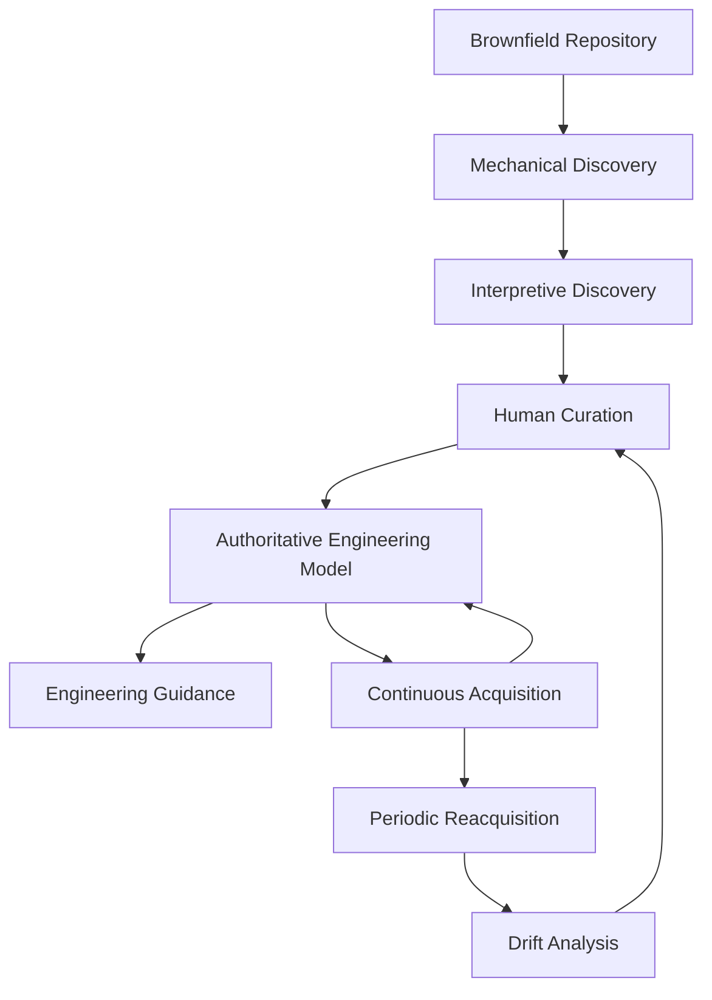

# The lifecycle a customer experiences

> **This is the primary structure of the product** (`ADR-0141`). The compiler's
> phases are an implementation of one of these steps. They are how the model
> becomes trustworthy; they are not what anyone experiences.

**The loop is the product.** Every stage after the model exists to return to it.
A one-shot onboarding delivers none of the promise.

---

## 1 · Brownfield Repository

A system nobody on the team fully understands any more.

**Today:** two, chosen for engineering characteristics rather than language —
`ai-desk` (Node · NestJS · Drizzle) and `wa-b2b` (Java 21 · Spring Boot · JPA).

---

## 2 · Mechanical Discovery

Facts only. Packages, modules, routes, tables, test suites, configuration,
documents — each with its file and locator. **Nothing is named as engineering
knowledge.**

Where the facts live is **declared**, not coded: a Stack Profile per stack
(`ADR-0117`). A new stack costs a declaration.

**Reproducible by contract.** Re-running produces the same model, byte for byte,
which is what makes every downstream comparison fair.

**State: strong.**

---

## 3 · Interpretive Discovery

Reads **only** the Mechanical Model — never the repository (`ADR-0108`) — and
proposes engineering meaning: concepts, capabilities, invariants, artifacts and
the relationships between them.

Six deterministic rules today.

**Missing, and specified:** the non-deterministic **Brownfield Onboarding
Skill** (`ADR-0140`) — an expert engineering partner that reads prose as well as
structure. It proposes with evidence and decides nothing.

**State: deterministic only.** Two repositories, and *why does this system work
this way?* answers nothing in either. More rules will not reach it.

---

## 4 · Human Curation

**The only stage where a person decides anything.** Every proposal — from a rule
or from a frontier model — enters the model here or not at all.

`ai-desk`: **72 of 299 proposals authorized.** The 227 that were not are a
recorded choice, and the drift report states the size of that choice.

**State: the weakest stage in the lifecycle.** It has only ever run as a filter
function in a script. **No human has curated a model in this system.**

---

## 5 · Authoritative Engineering Model

The product, and the **API between the two halves of it** (`ADR-0135`).

Every assertion carries its source, locator, worker, task and support. Nothing
enters without curation. Twenty-three entity types, unchanged for fourteen
milestones and unchanged by a Java Spring application.

**State: strong.**

---

## 6 · Engineering Guidance

Consumes the model and recommends work: queries, recommendations, plans, task
graphs, worker routing.

**Measured for the first time in `SESSION-0050`: Guidance Preservation 80 %** —
of subjects nobody touched across ten commits, how many still get the same
advice (`ADR-0139`).

**State: measurable, and the weakest of the five verbs.** It has never run
against a model it did not build for itself.

---

## 7 · Continuous Acquisition

A commit lands. Only what changed is proposed, and it is proposed with the same
meaning the onboarding established (`ADR-0130`).

**Understanding Retention: 100 %** across ten real commits. **13–15 %** the cost
of re-running discovery every time.

**Retractions are governed, never applied.**

**State: strong.**

---

## 8 · Periodic Reacquisition

Onboarding-quality discovery, run again. **Its purpose is not to rebuild the
model.** It is to challenge what the model claims.

**Nothing it produces is applied.**

**State: works.**

---

## 9 · Drift Analysis

The challenge, made actionable. Fifteen drift classes, **each routed to an
Engineering Plan** — a drift report is a work queue, not a document
(`ADR-0114`).

Three classes route nowhere and each says why.

**State: works.**

---

## 10 · Repeat

Back to curation, with a queue of proposals rather than a blank page.

**State: run once, over ten commits, on one repository.** This is the stage the
entire promise rests on and it has the least evidence behind it.

---

## What the customer is promised

> **We preserve an engineering team's ability to make correct engineering
> decisions as software evolves.** (`ADR-0136`)

And what is measured against it today:

| Property | Asks | Today |
|---|---|---|
| Knowledge Preservation | do we still know the same facts? | not measured |
| **Understanding Preservation** | can we still explain the system? | **100 %** |
| **Guidance Preservation** | is the recommended work the same? | **80 %** |
| **Decision Preservation** | does the team still decide correctly? | **not measured — the promise** |

**The two measured properties disagree**, on the same run, over the same
commits. That disagreement is the honest state of the product
(`ADR-0138`).
