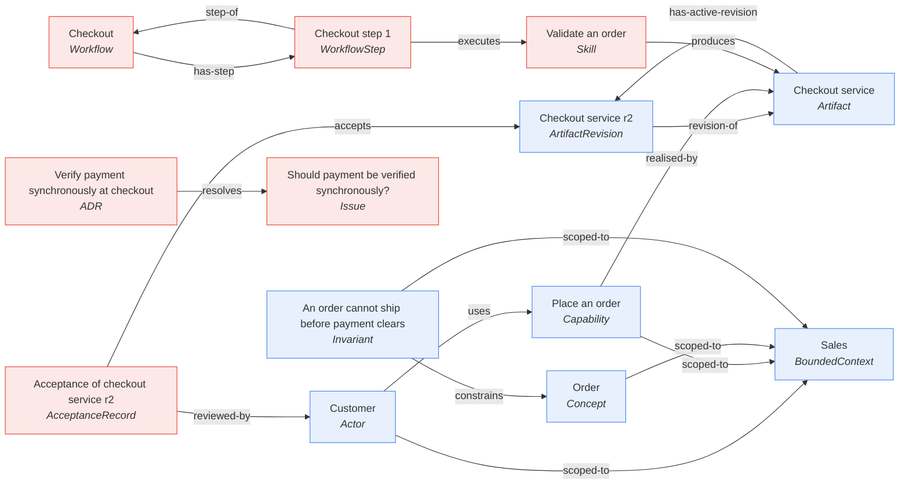

# Generated graph — tiny example

> **Generated by `tools/compile.py`. Do not edit.**

**13 nodes, 16 edges.**

```mermaid
graph LR
  AcceptanceRecord_0001["Acceptance of checkout service r2<br/><i>AcceptanceRecord</i>"]
  Actor_Customer["Customer<br/><i>Actor</i>"]
  ADR_0001["Verify payment synchronously at checkout<br/><i>ADR</i>"]
  Artifact_CheckoutService["Checkout service<br/><i>Artifact</i>"]
  ArtifactRevision_CheckoutService_r2["Checkout service r2<br/><i>ArtifactRevision</i>"]
  BoundedContext_Sales["Sales<br/><i>BoundedContext</i>"]
  Capability_PlaceOrder["Place an order<br/><i>Capability</i>"]
  Concept_Order["Order<br/><i>Concept</i>"]
  Invariant_PaymentBeforeShipping["An order cannot ship before payment clears<br/><i>Invariant</i>"]
  Issue_0001["Should payment be verified synchronously?<br/><i>Issue</i>"]
  Skill_ValidateOrder["Validate an order<br/><i>Skill</i>"]
  Workflow_Checkout["Checkout<br/><i>Workflow</i>"]
  WorkflowStep_Checkout_1["Checkout step 1<br/><i>WorkflowStep</i>"]
  AcceptanceRecord_0001 -->|accepts| ArtifactRevision_CheckoutService_r2
  AcceptanceRecord_0001 -->|reviewed-by| Actor_Customer
  Actor_Customer -->|scoped-to| BoundedContext_Sales
  Actor_Customer -->|uses| Capability_PlaceOrder
  ADR_0001 -->|resolves| Issue_0001
  Artifact_CheckoutService -->|has-active-revision| ArtifactRevision_CheckoutService_r2
  ArtifactRevision_CheckoutService_r2 -->|revision-of| Artifact_CheckoutService
  Capability_PlaceOrder -->|scoped-to| BoundedContext_Sales
  Capability_PlaceOrder -->|realised-by| Artifact_CheckoutService
  Concept_Order -->|scoped-to| BoundedContext_Sales
  Invariant_PaymentBeforeShipping -->|scoped-to| BoundedContext_Sales
  Invariant_PaymentBeforeShipping -->|constrains| Concept_Order
  Skill_ValidateOrder -->|produces| Artifact_CheckoutService
  Workflow_Checkout -->|has-step| WorkflowStep_Checkout_1
  WorkflowStep_Checkout_1 -->|step-of| Workflow_Checkout
  WorkflowStep_Checkout_1 -->|executes| Skill_ValidateOrder
  class Actor_Customer,Artifact_CheckoutService,ArtifactRevision_CheckoutService_r2,BoundedContext_Sales,Capability_PlaceOrder,Concept_Order,Invariant_PaymentBeforeShipping descriptive;
  class AcceptanceRecord_0001,ADR_0001,Issue_0001,Skill_ValidateOrder,Workflow_Checkout,WorkflowStep_Checkout_1 operational;
  classDef descriptive fill:#e8f0fe,stroke:#4285f4;
  classDef operational fill:#fce8e6,stroke:#ea4335;
```
