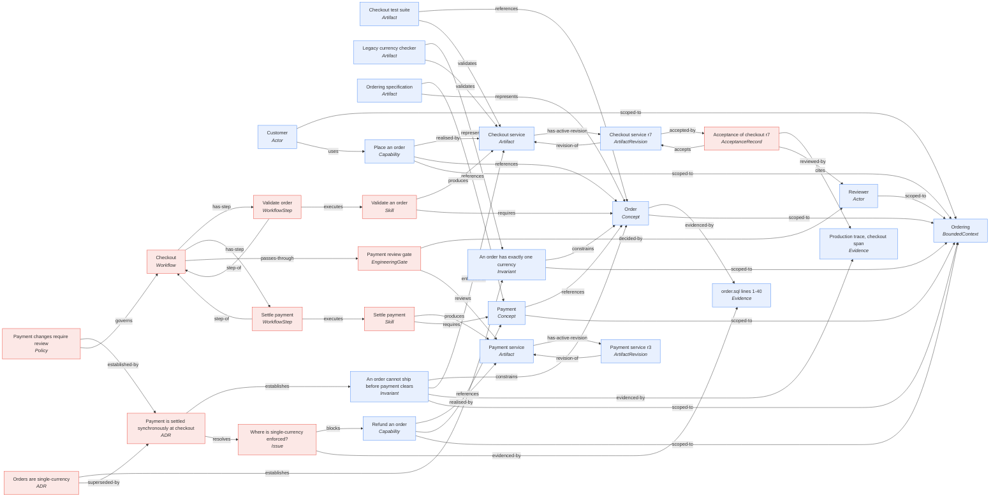

# Generated graph

> **A projection of the Canonical Knowledge Model.**
> Generated by the compiler. Do not edit.

**29 nodes, 54 edges.**

```mermaid
graph LR
  ADR_004["Orders are single-currency<br/><i>ADR</i>"]
  ADR_011["Payment is settled synchronously at checkout<br/><i>ADR</i>"]
  AcceptanceRecord_014["Acceptance of checkout r7<br/><i>AcceptanceRecord</i>"]
  Actor_Customer["Customer<br/><i>Actor</i>"]
  Actor_Reviewer["Reviewer<br/><i>Actor</i>"]
  Artifact_CheckoutService["Checkout service<br/><i>Artifact</i>"]
  Artifact_CheckoutTests["Checkout test suite<br/><i>Artifact</i>"]
  Artifact_CurrencyCheck["Legacy currency checker<br/><i>Artifact</i>"]
  Artifact_OrderingSpec["Ordering specification<br/><i>Artifact</i>"]
  Artifact_PaymentService["Payment service<br/><i>Artifact</i>"]
  ArtifactRevision_Checkout_r7["Checkout service r7<br/><i>ArtifactRevision</i>"]
  ArtifactRevision_Payment_r3["Payment service r3<br/><i>ArtifactRevision</i>"]
  BC_Ordering["Ordering<br/><i>BoundedContext</i>"]
  Capability_PlaceOrder["Place an order<br/><i>Capability</i>"]
  Capability_Refund["Refund an order<br/><i>Capability</i>"]
  Concept_Order["Order<br/><i>Concept</i>"]
  Concept_Payment["Payment<br/><i>Concept</i>"]
  Evidence_OrderSchema["order.sql lines 1-40<br/><i>Evidence</i>"]
  Evidence_PaymentTrace["Production trace, checkout span<br/><i>Evidence</i>"]
  Gate_PaymentReview["Payment review gate<br/><i>EngineeringGate</i>"]
  Invariant_PaymentBeforeShipping["An order cannot ship before payment clears<br/><i>Invariant</i>"]
  Invariant_SingleCurrency["An order has exactly one currency<br/><i>Invariant</i>"]
  Issue_023["Where is single-currency enforced?<br/><i>Issue</i>"]
  Policy_PaymentChangesReviewed["Payment changes require review<br/><i>Policy</i>"]
  Skill_SettlePayment["Settle payment<br/><i>Skill</i>"]
  Skill_ValidateOrder["Validate an order<br/><i>Skill</i>"]
  Workflow_Checkout["Checkout<br/><i>Workflow</i>"]
  WorkflowStep_Checkout_1["Validate order<br/><i>WorkflowStep</i>"]
  WorkflowStep_Checkout_2["Settle payment<br/><i>WorkflowStep</i>"]
  ADR_004 -->|establishes| Invariant_SingleCurrency
  ADR_004 -->|superseded-by| ADR_011
  ADR_011 -->|establishes| Invariant_PaymentBeforeShipping
  ADR_011 -->|resolves| Issue_023
  AcceptanceRecord_014 -->|accepts| ArtifactRevision_Checkout_r7
  AcceptanceRecord_014 -->|cites| Evidence_PaymentTrace
  AcceptanceRecord_014 -->|reviewed-by| Actor_Reviewer
  Actor_Customer -->|scoped-to| BC_Ordering
  Actor_Customer -->|uses| Capability_PlaceOrder
  Actor_Reviewer -->|scoped-to| BC_Ordering
  Artifact_CheckoutService -->|has-active-revision| ArtifactRevision_Checkout_r7
  Artifact_CheckoutTests -->|references| Concept_Order
  Artifact_CheckoutTests -->|validates| Artifact_CheckoutService
  Artifact_CurrencyCheck -->|represents| Invariant_SingleCurrency
  Artifact_CurrencyCheck -->|validates| Artifact_CheckoutService
  Artifact_OrderingSpec -->|references| Concept_Payment
  Artifact_OrderingSpec -->|represents| Concept_Order
  Artifact_PaymentService -->|has-active-revision| ArtifactRevision_Payment_r3
  ArtifactRevision_Checkout_r7 -->|accepted-by| AcceptanceRecord_014
  ArtifactRevision_Checkout_r7 -->|revision-of| Artifact_CheckoutService
  ArtifactRevision_Payment_r3 -->|revision-of| Artifact_PaymentService
  Capability_PlaceOrder -->|realised-by| Artifact_CheckoutService
  Capability_PlaceOrder -->|references| Concept_Order
  Capability_PlaceOrder -->|scoped-to| BC_Ordering
  Capability_Refund -->|realised-by| Artifact_PaymentService
  Capability_Refund -->|references| Concept_Payment
  Capability_Refund -->|scoped-to| BC_Ordering
  Concept_Order -->|evidenced-by| Evidence_OrderSchema
  Concept_Order -->|scoped-to| BC_Ordering
  Concept_Payment -->|references| Concept_Order
  Concept_Payment -->|scoped-to| BC_Ordering
  Gate_PaymentReview -->|decided-by| Actor_Reviewer
  Gate_PaymentReview -->|reviews| Artifact_PaymentService
  Invariant_PaymentBeforeShipping -->|constrains| Concept_Order
  Invariant_PaymentBeforeShipping -->|enforced-at| Artifact_CheckoutService
  Invariant_PaymentBeforeShipping -->|evidenced-by| Evidence_PaymentTrace
  Invariant_PaymentBeforeShipping -->|scoped-to| BC_Ordering
  Invariant_SingleCurrency -->|constrains| Concept_Order
  Invariant_SingleCurrency -->|scoped-to| BC_Ordering
  Issue_023 -->|blocks| Capability_Refund
  Issue_023 -->|evidenced-by| Evidence_OrderSchema
  Policy_PaymentChangesReviewed -->|established-by| ADR_011
  Policy_PaymentChangesReviewed -->|governs| Workflow_Checkout
  Skill_SettlePayment -->|produces| Artifact_PaymentService
  Skill_SettlePayment -->|requires| Concept_Payment
  Skill_ValidateOrder -->|produces| Artifact_CheckoutService
  Skill_ValidateOrder -->|requires| Concept_Order
  Workflow_Checkout -->|has-step| WorkflowStep_Checkout_1
  Workflow_Checkout -->|has-step| WorkflowStep_Checkout_2
  Workflow_Checkout -->|passes-through| Gate_PaymentReview
  WorkflowStep_Checkout_1 -->|executes| Skill_ValidateOrder
  WorkflowStep_Checkout_1 -->|step-of| Workflow_Checkout
  WorkflowStep_Checkout_2 -->|executes| Skill_SettlePayment
  WorkflowStep_Checkout_2 -->|step-of| Workflow_Checkout
  class Actor_Customer,Actor_Reviewer,Artifact_CheckoutService,Artifact_CheckoutTests,Artifact_CurrencyCheck,Artifact_OrderingSpec,Artifact_PaymentService,ArtifactRevision_Checkout_r7,ArtifactRevision_Payment_r3,BC_Ordering,Capability_PlaceOrder,Capability_Refund,Concept_Order,Concept_Payment,Evidence_OrderSchema,Evidence_PaymentTrace,Invariant_PaymentBeforeShipping,Invariant_SingleCurrency descriptive;
  class ADR_004,ADR_011,AcceptanceRecord_014,Gate_PaymentReview,Issue_023,Policy_PaymentChangesReviewed,Skill_SettlePayment,Skill_ValidateOrder,Workflow_Checkout,WorkflowStep_Checkout_1,WorkflowStep_Checkout_2 operational;
  classDef descriptive fill:#e8f0fe,stroke:#4285f4;
  classDef operational fill:#fce8e6,stroke:#ea4335;
```
