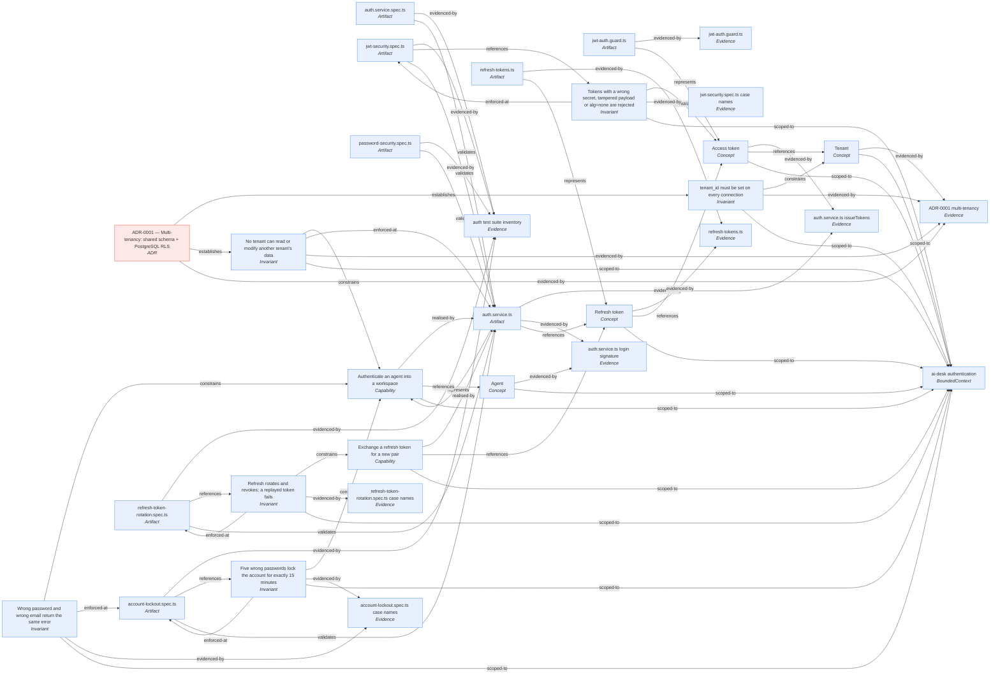

# Generated graph

> **A projection of the Canonical Knowledge Model.**
> Generated by the compiler. Do not edit.

**31 nodes, 63 edges.**

```mermaid
graph LR
  ADR_0001["ADR-0001 — Multi-tenancy: shared schema + PostgreSQL RLS<br/><i>ADR</i>"]
  Artifact_AccountLockoutTests["account-lockout.spec.ts<br/><i>Artifact</i>"]
  Artifact_AuthService["auth.service.ts<br/><i>Artifact</i>"]
  Artifact_AuthServiceTests["auth.service.spec.ts<br/><i>Artifact</i>"]
  Artifact_JwtGuard["jwt-auth.guard.ts<br/><i>Artifact</i>"]
  Artifact_JwtSecurityTests["jwt-security.spec.ts<br/><i>Artifact</i>"]
  Artifact_PasswordSecurityTests["password-security.spec.ts<br/><i>Artifact</i>"]
  Artifact_RefreshRotationTests["refresh-token-rotation.spec.ts<br/><i>Artifact</i>"]
  Artifact_RefreshTokenSchema["refresh-tokens.ts<br/><i>Artifact</i>"]
  BC_Auth["ai-desk authentication<br/><i>BoundedContext</i>"]
  Capability_Login["Authenticate an agent into a workspace<br/><i>Capability</i>"]
  Capability_RefreshSession["Exchange a refresh token for a new pair<br/><i>Capability</i>"]
  Concept_AccessToken["Access token<br/><i>Concept</i>"]
  Concept_Agent["Agent<br/><i>Concept</i>"]
  Concept_RefreshToken["Refresh token<br/><i>Concept</i>"]
  Concept_Tenant["Tenant<br/><i>Concept</i>"]
  Evidence_Adr0001["ADR-0001 multi-tenancy<br/><i>Evidence</i>"]
  Evidence_GuardSymbols["jwt-auth.guard.ts<br/><i>Evidence</i>"]
  Evidence_IssueTokensSignature["auth.service.ts issueTokens<br/><i>Evidence</i>"]
  Evidence_JwtTests["jwt-security.spec.ts case names<br/><i>Evidence</i>"]
  Evidence_LockoutTests["account-lockout.spec.ts case names<br/><i>Evidence</i>"]
  Evidence_LoginSignature["auth.service.ts login signature<br/><i>Evidence</i>"]
  Evidence_RefreshTokenSchema["refresh-tokens.ts<br/><i>Evidence</i>"]
  Evidence_RotationTests["refresh-token-rotation.spec.ts case names<br/><i>Evidence</i>"]
  Evidence_TestInventory["auth test suite inventory<br/><i>Evidence</i>"]
  Invariant_AccountLockout["Five wrong passwords lock the account for exactly 15 minutes<br/><i>Invariant</i>"]
  Invariant_NoUserEnumeration["Wrong password and wrong email return the same error<br/><i>Invariant</i>"]
  Invariant_RefreshRotation["Refresh rotates and revokes; a replayed token fails<br/><i>Invariant</i>"]
  Invariant_TenantIdOnEveryConnection["tenant_id must be set on every connection<br/><i>Invariant</i>"]
  Invariant_TenantIsolation["No tenant can read or modify another tenant's data<br/><i>Invariant</i>"]
  Invariant_TokenIntegrity["Tokens with a wrong secret, tampered payload or alg=none are rejected<br/><i>Invariant</i>"]
  ADR_0001 -->|establishes| Invariant_TenantIdOnEveryConnection
  ADR_0001 -->|establishes| Invariant_TenantIsolation
  ADR_0001 -->|evidenced-by| Evidence_Adr0001
  Artifact_AccountLockoutTests -->|evidenced-by| Evidence_TestInventory
  Artifact_AccountLockoutTests -->|references| Invariant_AccountLockout
  Artifact_AccountLockoutTests -->|validates| Artifact_AuthService
  Artifact_AuthService -->|evidenced-by| Evidence_IssueTokensSignature
  Artifact_AuthService -->|evidenced-by| Evidence_LoginSignature
  Artifact_AuthService -->|references| Concept_RefreshToken
  Artifact_AuthService -->|represents| Capability_Login
  Artifact_AuthServiceTests -->|evidenced-by| Evidence_TestInventory
  Artifact_AuthServiceTests -->|validates| Artifact_AuthService
  Artifact_JwtGuard -->|evidenced-by| Evidence_GuardSymbols
  Artifact_JwtGuard -->|represents| Concept_AccessToken
  Artifact_JwtSecurityTests -->|evidenced-by| Evidence_TestInventory
  Artifact_JwtSecurityTests -->|references| Invariant_TokenIntegrity
  Artifact_JwtSecurityTests -->|validates| Artifact_AuthService
  Artifact_PasswordSecurityTests -->|evidenced-by| Evidence_TestInventory
  Artifact_PasswordSecurityTests -->|validates| Artifact_AuthService
  Artifact_RefreshRotationTests -->|evidenced-by| Evidence_TestInventory
  Artifact_RefreshRotationTests -->|references| Invariant_RefreshRotation
  Artifact_RefreshRotationTests -->|validates| Artifact_AuthService
  Artifact_RefreshTokenSchema -->|evidenced-by| Evidence_RefreshTokenSchema
  Artifact_RefreshTokenSchema -->|represents| Concept_RefreshToken
  Capability_Login -->|realised-by| Artifact_AuthService
  Capability_Login -->|references| Concept_Agent
  Capability_Login -->|scoped-to| BC_Auth
  Capability_RefreshSession -->|realised-by| Artifact_AuthService
  Capability_RefreshSession -->|references| Concept_RefreshToken
  Capability_RefreshSession -->|scoped-to| BC_Auth
  Concept_AccessToken -->|evidenced-by| Evidence_IssueTokensSignature
  Concept_AccessToken -->|references| Concept_Tenant
  Concept_AccessToken -->|scoped-to| BC_Auth
  Concept_Agent -->|evidenced-by| Evidence_LoginSignature
  Concept_Agent -->|scoped-to| BC_Auth
  Concept_RefreshToken -->|evidenced-by| Evidence_RefreshTokenSchema
  Concept_RefreshToken -->|references| Concept_AccessToken
  Concept_RefreshToken -->|scoped-to| BC_Auth
  Concept_Tenant -->|evidenced-by| Evidence_Adr0001
  Concept_Tenant -->|scoped-to| BC_Auth
  Invariant_AccountLockout -->|constrains| Capability_Login
  Invariant_AccountLockout -->|enforced-at| Artifact_AccountLockoutTests
  Invariant_AccountLockout -->|evidenced-by| Evidence_LockoutTests
  Invariant_AccountLockout -->|scoped-to| BC_Auth
  Invariant_NoUserEnumeration -->|constrains| Capability_Login
  Invariant_NoUserEnumeration -->|enforced-at| Artifact_AccountLockoutTests
  Invariant_NoUserEnumeration -->|evidenced-by| Evidence_LockoutTests
  Invariant_NoUserEnumeration -->|scoped-to| BC_Auth
  Invariant_RefreshRotation -->|constrains| Capability_RefreshSession
  Invariant_RefreshRotation -->|enforced-at| Artifact_RefreshRotationTests
  Invariant_RefreshRotation -->|evidenced-by| Evidence_RotationTests
  Invariant_RefreshRotation -->|scoped-to| BC_Auth
  Invariant_TenantIdOnEveryConnection -->|constrains| Concept_Tenant
  Invariant_TenantIdOnEveryConnection -->|evidenced-by| Evidence_Adr0001
  Invariant_TenantIdOnEveryConnection -->|scoped-to| BC_Auth
  Invariant_TenantIsolation -->|constrains| Capability_Login
  Invariant_TenantIsolation -->|enforced-at| Artifact_AuthService
  Invariant_TenantIsolation -->|evidenced-by| Evidence_Adr0001
  Invariant_TenantIsolation -->|scoped-to| BC_Auth
  Invariant_TokenIntegrity -->|constrains| Concept_AccessToken
  Invariant_TokenIntegrity -->|enforced-at| Artifact_JwtSecurityTests
  Invariant_TokenIntegrity -->|evidenced-by| Evidence_JwtTests
  Invariant_TokenIntegrity -->|scoped-to| BC_Auth
  class Artifact_AccountLockoutTests,Artifact_AuthService,Artifact_AuthServiceTests,Artifact_JwtGuard,Artifact_JwtSecurityTests,Artifact_PasswordSecurityTests,Artifact_RefreshRotationTests,Artifact_RefreshTokenSchema,BC_Auth,Capability_Login,Capability_RefreshSession,Concept_AccessToken,Concept_Agent,Concept_RefreshToken,Concept_Tenant,Evidence_Adr0001,Evidence_GuardSymbols,Evidence_IssueTokensSignature,Evidence_JwtTests,Evidence_LockoutTests,Evidence_LoginSignature,Evidence_RefreshTokenSchema,Evidence_RotationTests,Evidence_TestInventory,Invariant_AccountLockout,Invariant_NoUserEnumeration,Invariant_RefreshRotation,Invariant_TenantIdOnEveryConnection,Invariant_TenantIsolation,Invariant_TokenIntegrity descriptive;
  class ADR_0001 operational;
  classDef descriptive fill:#e8f0fe,stroke:#4285f4;
  classDef operational fill:#fce8e6,stroke:#ea4335;
```
