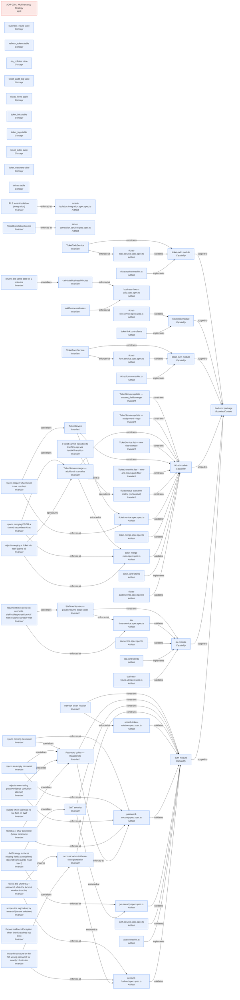

# Generated graph

> **A projection of the Canonical Knowledge Model.**
> Generated by the compiler. Do not edit.

**76 nodes, 78 edges.**

```mermaid
graph LR
  ADR_0001["ADR-0001: Multi-tenancy Strategy<br/><i>ADR</i>"]
  Artifact_AccountLockoutSpec["account-lockout.spec.spec.ts<br/><i>Artifact</i>"]
  Artifact_AuthController["auth.controller.ts<br/><i>Artifact</i>"]
  Artifact_AuthServiceSpec["auth.service.spec.spec.ts<br/><i>Artifact</i>"]
  Artifact_BusinessHoursCalcSpec["business-hours-calc.spec.spec.ts<br/><i>Artifact</i>"]
  Artifact_BusinessHoursUtilSpec["business-hours.util.spec.spec.ts<br/><i>Artifact</i>"]
  Artifact_JwtSecuritySpec["jwt-security.spec.spec.ts<br/><i>Artifact</i>"]
  Artifact_PasswordSecuritySpec["password-security.spec.spec.ts<br/><i>Artifact</i>"]
  Artifact_RefreshTokenRotationSpec["refresh-token-rotation.spec.spec.ts<br/><i>Artifact</i>"]
  Artifact_SlaController["sla.controller.ts<br/><i>Artifact</i>"]
  Artifact_SlaServiceSpec["sla.service.spec.spec.ts<br/><i>Artifact</i>"]
  Artifact_SlaTimerServiceSpec["sla-timer.service.spec.spec.ts<br/><i>Artifact</i>"]
  Artifact_TenantIsolationIntegrationSpec["tenant-isolation.integration.spec.spec.ts<br/><i>Artifact</i>"]
  Artifact_TicketAuditServiceSpec["ticket-audit.service.spec.spec.ts<br/><i>Artifact</i>"]
  Artifact_TicketController["ticket.controller.ts<br/><i>Artifact</i>"]
  Artifact_TicketCorrelationServiceSpec["ticket-correlation.service.spec.spec.ts<br/><i>Artifact</i>"]
  Artifact_TicketFormController["ticket-form.controller.ts<br/><i>Artifact</i>"]
  Artifact_TicketFormServiceSpec["ticket-form.service.spec.spec.ts<br/><i>Artifact</i>"]
  Artifact_TicketLinkController["ticket-link.controller.ts<br/><i>Artifact</i>"]
  Artifact_TicketLinkServiceSpec["ticket-link.service.spec.spec.ts<br/><i>Artifact</i>"]
  Artifact_TicketMergeExtraSpec["ticket-merge-extra.spec.spec.ts<br/><i>Artifact</i>"]
  Artifact_TicketMergeSpec["ticket-merge.spec.spec.ts<br/><i>Artifact</i>"]
  Artifact_TicketServiceSpec["ticket.service.spec.spec.ts<br/><i>Artifact</i>"]
  Artifact_TicketTodoController["ticket-todo.controller.ts<br/><i>Artifact</i>"]
  Artifact_TicketTodoServiceSpec["ticket-todo.service.spec.spec.ts<br/><i>Artifact</i>"]
  BoundedContext_Backend["backend package<br/><i>BoundedContext</i>"]
  Capability_Auth["auth module<br/><i>Capability</i>"]
  Capability_Sla["sla module<br/><i>Capability</i>"]
  Capability_Ticket["ticket module<br/><i>Capability</i>"]
  Capability_TicketForm["ticket-form module<br/><i>Capability</i>"]
  Capability_TicketLink["ticket-link module<br/><i>Capability</i>"]
  Capability_TicketTodo["ticket-todo module<br/><i>Capability</i>"]
  Concept_TableBusinessHours["business_hours table<br/><i>Concept</i>"]
  Concept_TableRefreshTokens["refresh_tokens table<br/><i>Concept</i>"]
  Concept_TableSlaPolicies["sla_policies table<br/><i>Concept</i>"]
  Concept_TableTicketAuditLog["ticket_audit_log table<br/><i>Concept</i>"]
  Concept_TableTicketForms["ticket_forms table<br/><i>Concept</i>"]
  Concept_TableTicketLinks["ticket_links table<br/><i>Concept</i>"]
  Concept_TableTicketTags["ticket_tags table<br/><i>Concept</i>"]
  Concept_TableTicketTodos["ticket_todos table<br/><i>Concept</i>"]
  Concept_TableTicketWatchers["ticket_watchers table<br/><i>Concept</i>"]
  Concept_TableTickets["tickets table<br/><i>Concept</i>"]
  Invariant_ATicketCannotTransitionToItselfNoOpViaIsvali["a ticket cannot transition to itself (no-op) via isValidTransition<br/><i>Invariant</i>"]
  Invariant_AccountLockoutBruteForceProtection["account lockout & brute-force protection<br/><i>Invariant</i>"]
  Invariant_Addbusinessminutes["addBusinessMinutes<br/><i>Invariant</i>"]
  Invariant_Calculatebusinessminutes["calculateBusinessMinutes<br/><i>Invariant</i>"]
  Invariant_JwtSecurity["JWT security<br/><i>Invariant</i>"]
  Invariant_JwtstrategySurfacesMissingFieldsAsUndefinedD["JwtStrategy surfaces missing fields as undefined (downstream guards must reject)<br/><i>Invariant</i>"]
  Invariant_LocksTheAccountOnThe5ThWrongPasswordForExact["locks the account on the 5th wrong password for exactly 15 minutes<br/><i>Invariant</i>"]
  Invariant_PasswordPolicyRegisterdto["Password policy — RegisterDto<br/><i>Invariant</i>"]
  Invariant_RefreshTokenRotation["Refresh token rotation<br/><i>Invariant</i>"]
  Invariant_RejectsA7CharPasswordBelowMinimum["rejects a 7-char password (below minimum)<br/><i>Invariant</i>"]
  Invariant_RejectsANonStringPasswordTypeConfusionAttemp["rejects a non-string password (type confusion attempt)<br/><i>Invariant</i>"]
  Invariant_RejectsAnEmptyPassword["rejects an empty password<br/><i>Invariant</i>"]
  Invariant_RejectsMergingATicketIntoItselfSameId["rejects merging a ticket into itself (same id)<br/><i>Invariant</i>"]
  Invariant_RejectsMergingFromAClosedSecondaryTicket["rejects merging FROM a closed secondary ticket<br/><i>Invariant</i>"]
  Invariant_RejectsMissingPassword["rejects missing password<br/><i>Invariant</i>"]
  Invariant_RejectsReopenWhenTicketIsNotResolved["rejects reopen when ticket is not resolved<br/><i>Invariant</i>"]
  Invariant_RejectsTheCorrectPasswordWhileTheLockoutWind["rejects the CORRECT password while the lockout window is active<br/><i>Invariant</i>"]
  Invariant_RejectsWhenUserHasNoRoleFieldOnJwt["rejects when user has no role field on JWT<br/><i>Invariant</i>"]
  Invariant_ResumedTicketDoesNotOverwriteSlafirstrespons["resumed ticket does not overwrite slaFirstResponseDueAt if first response already met<br/><i>Invariant</i>"]
  Invariant_ReturnsTheSameDateFor0Minutes["returns the same date for 0 minutes<br/><i>Invariant</i>"]
  Invariant_RlsTenantIsolationIntegration["RLS tenant isolation (integration)<br/><i>Invariant</i>"]
  Invariant_ScopesTheTagLookupByTenantidTenantIsolation["scopes the tag lookup by tenantId (tenant isolation)<br/><i>Invariant</i>"]
  Invariant_SlatimerservicePauseResumeEdgeCases["SlaTimerService — pause/resume edge cases<br/><i>Invariant</i>"]
  Invariant_ThrowsNotfoundexceptionWhenTheTicketDoesNotE["throws NotFoundException when the ticket does not exist<br/><i>Invariant</i>"]
  Invariant_TicketStatusTransitionMatrixExhaustive["ticket status transition matrix (exhaustive)<br/><i>Invariant</i>"]
  Invariant_TicketcontrollerListNewAndMineQuickFilte["TicketController.list — new-and-mine quick filter<br/><i>Invariant</i>"]
  Invariant_Ticketcorrelationservice["TicketCorrelationService<br/><i>Invariant</i>"]
  Invariant_Ticketformservice["TicketFormService<br/><i>Invariant</i>"]
  Invariant_Ticketservice["TicketService<br/><i>Invariant</i>"]
  Invariant_TicketserviceListNewFilterSurface["TicketService.list — new filter surface<br/><i>Invariant</i>"]
  Invariant_TicketserviceMergeAdditionalScenarios["TicketService.merge — additional scenarios<br/><i>Invariant</i>"]
  Invariant_TicketserviceUpdateAssignmentTags["TicketService.update — assignment + tags<br/><i>Invariant</i>"]
  Invariant_TicketserviceUpdateCustomFieldsMerge["TicketService.update — custom_fields merge<br/><i>Invariant</i>"]
  Invariant_Tickettodoservice["TicketTodoService<br/><i>Invariant</i>"]
  Artifact_AccountLockoutSpec -->|validates| Capability_Auth
  Artifact_AuthController -->|implements| Capability_Auth
  Artifact_AuthServiceSpec -->|validates| Capability_Auth
  Artifact_BusinessHoursUtilSpec -->|validates| Capability_Sla
  Artifact_JwtSecuritySpec -->|validates| Capability_Auth
  Artifact_PasswordSecuritySpec -->|validates| Capability_Auth
  Artifact_RefreshTokenRotationSpec -->|validates| Capability_Auth
  Artifact_SlaController -->|implements| Capability_Sla
  Artifact_SlaServiceSpec -->|validates| Capability_Sla
  Artifact_SlaTimerServiceSpec -->|validates| Capability_Sla
  Artifact_TicketAuditServiceSpec -->|validates| Capability_Ticket
  Artifact_TicketController -->|implements| Capability_Ticket
  Artifact_TicketFormController -->|implements| Capability_TicketForm
  Artifact_TicketFormServiceSpec -->|validates| Capability_TicketForm
  Artifact_TicketLinkController -->|implements| Capability_TicketLink
  Artifact_TicketLinkServiceSpec -->|validates| Capability_TicketLink
  Artifact_TicketMergeExtraSpec -->|validates| Capability_Ticket
  Artifact_TicketMergeSpec -->|validates| Capability_Ticket
  Artifact_TicketServiceSpec -->|validates| Capability_Ticket
  Artifact_TicketTodoController -->|implements| Capability_TicketTodo
  Artifact_TicketTodoServiceSpec -->|validates| Capability_TicketTodo
  Capability_Auth -->|scoped-to| BoundedContext_Backend
  Capability_Sla -->|scoped-to| BoundedContext_Backend
  Capability_Ticket -->|scoped-to| BoundedContext_Backend
  Capability_TicketForm -->|scoped-to| BoundedContext_Backend
  Capability_TicketLink -->|scoped-to| BoundedContext_Backend
  Capability_TicketTodo -->|scoped-to| BoundedContext_Backend
  Invariant_ATicketCannotTransitionToItselfNoOpViaIsvali -->|specializes| Invariant_TicketStatusTransitionMatrixExhaustive
  Invariant_AccountLockoutBruteForceProtection -->|constrains| Capability_Auth
  Invariant_AccountLockoutBruteForceProtection -->|enforced-at| Artifact_AccountLockoutSpec
  Invariant_Addbusinessminutes -->|enforced-at| Artifact_BusinessHoursCalcSpec
  Invariant_Calculatebusinessminutes -->|enforced-at| Artifact_BusinessHoursCalcSpec
  Invariant_JwtSecurity -->|constrains| Capability_Auth
  Invariant_JwtSecurity -->|enforced-at| Artifact_JwtSecuritySpec
  Invariant_JwtstrategySurfacesMissingFieldsAsUndefinedD -->|enforced-at| Artifact_JwtSecuritySpec
  Invariant_JwtstrategySurfacesMissingFieldsAsUndefinedD -->|specializes| Invariant_JwtSecurity
  Invariant_LocksTheAccountOnThe5ThWrongPasswordForExact -->|enforced-at| Artifact_AccountLockoutSpec
  Invariant_LocksTheAccountOnThe5ThWrongPasswordForExact -->|specializes| Invariant_AccountLockoutBruteForceProtection
  Invariant_PasswordPolicyRegisterdto -->|constrains| Capability_Auth
  Invariant_PasswordPolicyRegisterdto -->|enforced-at| Artifact_PasswordSecuritySpec
  Invariant_RefreshTokenRotation -->|constrains| Capability_Auth
  Invariant_RefreshTokenRotation -->|enforced-at| Artifact_RefreshTokenRotationSpec
  Invariant_RejectsA7CharPasswordBelowMinimum -->|enforced-at| Artifact_PasswordSecuritySpec
  Invariant_RejectsA7CharPasswordBelowMinimum -->|specializes| Invariant_PasswordPolicyRegisterdto
  Invariant_RejectsANonStringPasswordTypeConfusionAttemp -->|enforced-at| Artifact_PasswordSecuritySpec
  Invariant_RejectsANonStringPasswordTypeConfusionAttemp -->|specializes| Invariant_PasswordPolicyRegisterdto
  Invariant_RejectsAnEmptyPassword -->|enforced-at| Artifact_PasswordSecuritySpec
  Invariant_RejectsAnEmptyPassword -->|specializes| Invariant_PasswordPolicyRegisterdto
  Invariant_RejectsMergingATicketIntoItselfSameId -->|enforced-at| Artifact_TicketMergeExtraSpec
  Invariant_RejectsMergingATicketIntoItselfSameId -->|specializes| Invariant_TicketserviceMergeAdditionalScenarios
  Invariant_RejectsMergingFromAClosedSecondaryTicket -->|enforced-at| Artifact_TicketMergeExtraSpec
  Invariant_RejectsMergingFromAClosedSecondaryTicket -->|specializes| Invariant_TicketserviceMergeAdditionalScenarios
  Invariant_RejectsMissingPassword -->|enforced-at| Artifact_PasswordSecuritySpec
  Invariant_RejectsMissingPassword -->|specializes| Invariant_PasswordPolicyRegisterdto
  Invariant_RejectsReopenWhenTicketIsNotResolved -->|enforced-at| Artifact_TicketServiceSpec
  Invariant_RejectsReopenWhenTicketIsNotResolved -->|specializes| Invariant_Ticketservice
  Invariant_RejectsTheCorrectPasswordWhileTheLockoutWind -->|enforced-at| Artifact_AccountLockoutSpec
  Invariant_RejectsTheCorrectPasswordWhileTheLockoutWind -->|specializes| Invariant_AccountLockoutBruteForceProtection
  Invariant_ResumedTicketDoesNotOverwriteSlafirstrespons -->|enforced-at| Artifact_SlaTimerServiceSpec
  Invariant_ResumedTicketDoesNotOverwriteSlafirstrespons -->|specializes| Invariant_SlatimerservicePauseResumeEdgeCases
  Invariant_ReturnsTheSameDateFor0Minutes -->|specializes| Invariant_Calculatebusinessminutes
  Invariant_RlsTenantIsolationIntegration -->|enforced-at| Artifact_TenantIsolationIntegrationSpec
  Invariant_SlatimerservicePauseResumeEdgeCases -->|constrains| Capability_Sla
  Invariant_SlatimerservicePauseResumeEdgeCases -->|enforced-at| Artifact_SlaTimerServiceSpec
  Invariant_TicketStatusTransitionMatrixExhaustive -->|constrains| Capability_Ticket
  Invariant_TicketcontrollerListNewAndMineQuickFilte -->|constrains| Capability_Ticket
  Invariant_Ticketcorrelationservice -->|enforced-at| Artifact_TicketCorrelationServiceSpec
  Invariant_Ticketformservice -->|constrains| Capability_TicketForm
  Invariant_Ticketformservice -->|enforced-at| Artifact_TicketFormServiceSpec
  Invariant_Ticketservice -->|constrains| Capability_Ticket
  Invariant_Ticketservice -->|enforced-at| Artifact_TicketServiceSpec
  Invariant_TicketserviceListNewFilterSurface -->|constrains| Capability_Ticket
  Invariant_TicketserviceMergeAdditionalScenarios -->|constrains| Capability_Ticket
  Invariant_TicketserviceMergeAdditionalScenarios -->|enforced-at| Artifact_TicketMergeExtraSpec
  Invariant_TicketserviceUpdateAssignmentTags -->|constrains| Capability_Ticket
  Invariant_TicketserviceUpdateCustomFieldsMerge -->|constrains| Capability_Ticket
  Invariant_Tickettodoservice -->|constrains| Capability_TicketTodo
  Invariant_Tickettodoservice -->|enforced-at| Artifact_TicketTodoServiceSpec
  class Artifact_AccountLockoutSpec,Artifact_AuthController,Artifact_AuthServiceSpec,Artifact_BusinessHoursCalcSpec,Artifact_BusinessHoursUtilSpec,Artifact_JwtSecuritySpec,Artifact_PasswordSecuritySpec,Artifact_RefreshTokenRotationSpec,Artifact_SlaController,Artifact_SlaServiceSpec,Artifact_SlaTimerServiceSpec,Artifact_TenantIsolationIntegrationSpec,Artifact_TicketAuditServiceSpec,Artifact_TicketController,Artifact_TicketCorrelationServiceSpec,Artifact_TicketFormController,Artifact_TicketFormServiceSpec,Artifact_TicketLinkController,Artifact_TicketLinkServiceSpec,Artifact_TicketMergeExtraSpec,Artifact_TicketMergeSpec,Artifact_TicketServiceSpec,Artifact_TicketTodoController,Artifact_TicketTodoServiceSpec,BoundedContext_Backend,Capability_Auth,Capability_Sla,Capability_Ticket,Capability_TicketForm,Capability_TicketLink,Capability_TicketTodo,Concept_TableBusinessHours,Concept_TableRefreshTokens,Concept_TableSlaPolicies,Concept_TableTicketAuditLog,Concept_TableTicketForms,Concept_TableTicketLinks,Concept_TableTicketTags,Concept_TableTicketTodos,Concept_TableTicketWatchers,Concept_TableTickets,Invariant_ATicketCannotTransitionToItselfNoOpViaIsvali,Invariant_AccountLockoutBruteForceProtection,Invariant_Addbusinessminutes,Invariant_Calculatebusinessminutes,Invariant_JwtSecurity,Invariant_JwtstrategySurfacesMissingFieldsAsUndefinedD,Invariant_LocksTheAccountOnThe5ThWrongPasswordForExact,Invariant_PasswordPolicyRegisterdto,Invariant_RefreshTokenRotation,Invariant_RejectsA7CharPasswordBelowMinimum,Invariant_RejectsANonStringPasswordTypeConfusionAttemp,Invariant_RejectsAnEmptyPassword,Invariant_RejectsMergingATicketIntoItselfSameId,Invariant_RejectsMergingFromAClosedSecondaryTicket,Invariant_RejectsMissingPassword,Invariant_RejectsReopenWhenTicketIsNotResolved,Invariant_RejectsTheCorrectPasswordWhileTheLockoutWind,Invariant_RejectsWhenUserHasNoRoleFieldOnJwt,Invariant_ResumedTicketDoesNotOverwriteSlafirstrespons,Invariant_ReturnsTheSameDateFor0Minutes,Invariant_RlsTenantIsolationIntegration,Invariant_ScopesTheTagLookupByTenantidTenantIsolation,Invariant_SlatimerservicePauseResumeEdgeCases,Invariant_ThrowsNotfoundexceptionWhenTheTicketDoesNotE,Invariant_TicketStatusTransitionMatrixExhaustive,Invariant_TicketcontrollerListNewAndMineQuickFilte,Invariant_Ticketcorrelationservice,Invariant_Ticketformservice,Invariant_Ticketservice,Invariant_TicketserviceListNewFilterSurface,Invariant_TicketserviceMergeAdditionalScenarios,Invariant_TicketserviceUpdateAssignmentTags,Invariant_TicketserviceUpdateCustomFieldsMerge,Invariant_Tickettodoservice descriptive;
  class ADR_0001 operational;
  classDef descriptive fill:#e8f0fe,stroke:#4285f4;
  classDef operational fill:#fce8e6,stroke:#ea4335;
```
