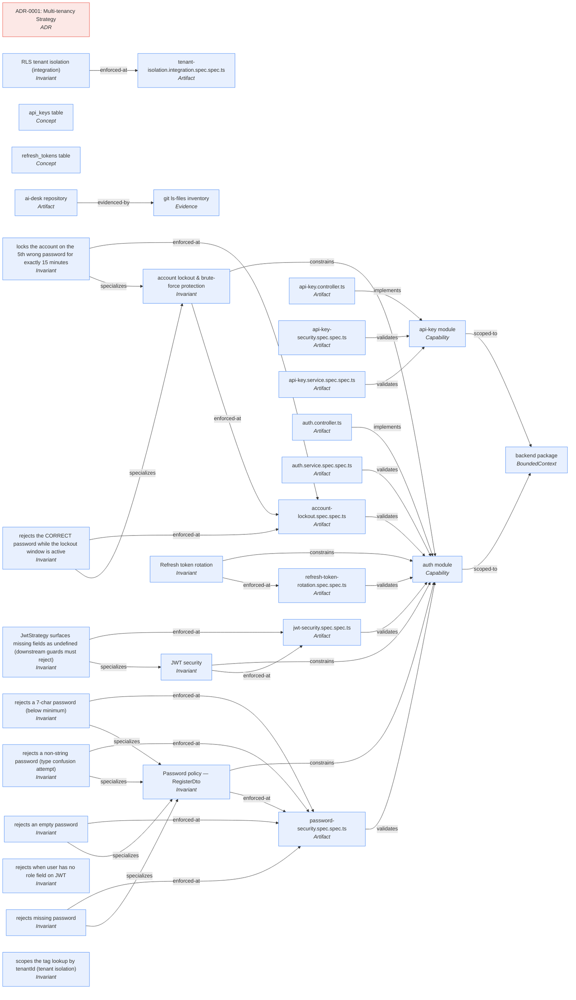

# Generated graph

> **A projection of the Canonical Knowledge Model.**
> Generated by the compiler. Do not edit.

**32 nodes, 35 edges.**

```mermaid
graph LR
  ADR_0001["ADR-0001: Multi-tenancy Strategy<br/><i>ADR</i>"]
  Artifact_AccountLockoutSpec["account-lockout.spec.spec.ts<br/><i>Artifact</i>"]
  Artifact_AiDeskRepository["ai-desk repository<br/><i>Artifact</i>"]
  Artifact_ApiKeyController["api-key.controller.ts<br/><i>Artifact</i>"]
  Artifact_ApiKeySecuritySpec["api-key-security.spec.spec.ts<br/><i>Artifact</i>"]
  Artifact_ApiKeyServiceSpec["api-key.service.spec.spec.ts<br/><i>Artifact</i>"]
  Artifact_AuthController["auth.controller.ts<br/><i>Artifact</i>"]
  Artifact_AuthServiceSpec["auth.service.spec.spec.ts<br/><i>Artifact</i>"]
  Artifact_JwtSecuritySpec["jwt-security.spec.spec.ts<br/><i>Artifact</i>"]
  Artifact_PasswordSecuritySpec["password-security.spec.spec.ts<br/><i>Artifact</i>"]
  Artifact_RefreshTokenRotationSpec["refresh-token-rotation.spec.spec.ts<br/><i>Artifact</i>"]
  Artifact_TenantIsolationIntegrationSpec["tenant-isolation.integration.spec.spec.ts<br/><i>Artifact</i>"]
  BoundedContext_Backend["backend package<br/><i>BoundedContext</i>"]
  Capability_ApiKey["api-key module<br/><i>Capability</i>"]
  Capability_Auth["auth module<br/><i>Capability</i>"]
  Concept_TableApiKeys["api_keys table<br/><i>Concept</i>"]
  Concept_TableRefreshTokens["refresh_tokens table<br/><i>Concept</i>"]
  Evidence_RepositoryInventory["git ls-files inventory<br/><i>Evidence</i>"]
  Invariant_AccountLockoutBruteForceProtection["account lockout & brute-force protection<br/><i>Invariant</i>"]
  Invariant_JwtSecurity["JWT security<br/><i>Invariant</i>"]
  Invariant_JwtstrategySurfacesMissingFieldsAsUndefinedD["JwtStrategy surfaces missing fields as undefined (downstream guards must reject)<br/><i>Invariant</i>"]
  Invariant_LocksTheAccountOnThe5ThWrongPasswordForExact["locks the account on the 5th wrong password for exactly 15 minutes<br/><i>Invariant</i>"]
  Invariant_PasswordPolicyRegisterdto["Password policy — RegisterDto<br/><i>Invariant</i>"]
  Invariant_RefreshTokenRotation["Refresh token rotation<br/><i>Invariant</i>"]
  Invariant_RejectsA7CharPasswordBelowMinimum["rejects a 7-char password (below minimum)<br/><i>Invariant</i>"]
  Invariant_RejectsANonStringPasswordTypeConfusionAttemp["rejects a non-string password (type confusion attempt)<br/><i>Invariant</i>"]
  Invariant_RejectsAnEmptyPassword["rejects an empty password<br/><i>Invariant</i>"]
  Invariant_RejectsMissingPassword["rejects missing password<br/><i>Invariant</i>"]
  Invariant_RejectsTheCorrectPasswordWhileTheLockoutWind["rejects the CORRECT password while the lockout window is active<br/><i>Invariant</i>"]
  Invariant_RejectsWhenUserHasNoRoleFieldOnJwt["rejects when user has no role field on JWT<br/><i>Invariant</i>"]
  Invariant_RlsTenantIsolationIntegration["RLS tenant isolation (integration)<br/><i>Invariant</i>"]
  Invariant_ScopesTheTagLookupByTenantidTenantIsolation["scopes the tag lookup by tenantId (tenant isolation)<br/><i>Invariant</i>"]
  Artifact_AccountLockoutSpec -->|validates| Capability_Auth
  Artifact_AiDeskRepository -->|evidenced-by| Evidence_RepositoryInventory
  Artifact_ApiKeyController -->|implements| Capability_ApiKey
  Artifact_ApiKeySecuritySpec -->|validates| Capability_ApiKey
  Artifact_ApiKeyServiceSpec -->|validates| Capability_ApiKey
  Artifact_AuthController -->|implements| Capability_Auth
  Artifact_AuthServiceSpec -->|validates| Capability_Auth
  Artifact_JwtSecuritySpec -->|validates| Capability_Auth
  Artifact_PasswordSecuritySpec -->|validates| Capability_Auth
  Artifact_RefreshTokenRotationSpec -->|validates| Capability_Auth
  Capability_ApiKey -->|scoped-to| BoundedContext_Backend
  Capability_Auth -->|scoped-to| BoundedContext_Backend
  Invariant_AccountLockoutBruteForceProtection -->|constrains| Capability_Auth
  Invariant_AccountLockoutBruteForceProtection -->|enforced-at| Artifact_AccountLockoutSpec
  Invariant_JwtSecurity -->|constrains| Capability_Auth
  Invariant_JwtSecurity -->|enforced-at| Artifact_JwtSecuritySpec
  Invariant_JwtstrategySurfacesMissingFieldsAsUndefinedD -->|enforced-at| Artifact_JwtSecuritySpec
  Invariant_JwtstrategySurfacesMissingFieldsAsUndefinedD -->|specializes| Invariant_JwtSecurity
  Invariant_LocksTheAccountOnThe5ThWrongPasswordForExact -->|enforced-at| Artifact_AccountLockoutSpec
  Invariant_LocksTheAccountOnThe5ThWrongPasswordForExact -->|specializes| Invariant_AccountLockoutBruteForceProtection
  Invariant_PasswordPolicyRegisterdto -->|constrains| Capability_Auth
  Invariant_PasswordPolicyRegisterdto -->|enforced-at| Artifact_PasswordSecuritySpec
  Invariant_RefreshTokenRotation -->|constrains| Capability_Auth
  Invariant_RefreshTokenRotation -->|enforced-at| Artifact_RefreshTokenRotationSpec
  Invariant_RejectsA7CharPasswordBelowMinimum -->|enforced-at| Artifact_PasswordSecuritySpec
  Invariant_RejectsA7CharPasswordBelowMinimum -->|specializes| Invariant_PasswordPolicyRegisterdto
  Invariant_RejectsANonStringPasswordTypeConfusionAttemp -->|enforced-at| Artifact_PasswordSecuritySpec
  Invariant_RejectsANonStringPasswordTypeConfusionAttemp -->|specializes| Invariant_PasswordPolicyRegisterdto
  Invariant_RejectsAnEmptyPassword -->|enforced-at| Artifact_PasswordSecuritySpec
  Invariant_RejectsAnEmptyPassword -->|specializes| Invariant_PasswordPolicyRegisterdto
  Invariant_RejectsMissingPassword -->|enforced-at| Artifact_PasswordSecuritySpec
  Invariant_RejectsMissingPassword -->|specializes| Invariant_PasswordPolicyRegisterdto
  Invariant_RejectsTheCorrectPasswordWhileTheLockoutWind -->|enforced-at| Artifact_AccountLockoutSpec
  Invariant_RejectsTheCorrectPasswordWhileTheLockoutWind -->|specializes| Invariant_AccountLockoutBruteForceProtection
  Invariant_RlsTenantIsolationIntegration -->|enforced-at| Artifact_TenantIsolationIntegrationSpec
  class Artifact_AccountLockoutSpec,Artifact_AiDeskRepository,Artifact_ApiKeyController,Artifact_ApiKeySecuritySpec,Artifact_ApiKeyServiceSpec,Artifact_AuthController,Artifact_AuthServiceSpec,Artifact_JwtSecuritySpec,Artifact_PasswordSecuritySpec,Artifact_RefreshTokenRotationSpec,Artifact_TenantIsolationIntegrationSpec,BoundedContext_Backend,Capability_ApiKey,Capability_Auth,Concept_TableApiKeys,Concept_TableRefreshTokens,Evidence_RepositoryInventory,Invariant_AccountLockoutBruteForceProtection,Invariant_JwtSecurity,Invariant_JwtstrategySurfacesMissingFieldsAsUndefinedD,Invariant_LocksTheAccountOnThe5ThWrongPasswordForExact,Invariant_PasswordPolicyRegisterdto,Invariant_RefreshTokenRotation,Invariant_RejectsA7CharPasswordBelowMinimum,Invariant_RejectsANonStringPasswordTypeConfusionAttemp,Invariant_RejectsAnEmptyPassword,Invariant_RejectsMissingPassword,Invariant_RejectsTheCorrectPasswordWhileTheLockoutWind,Invariant_RejectsWhenUserHasNoRoleFieldOnJwt,Invariant_RlsTenantIsolationIntegration,Invariant_ScopesTheTagLookupByTenantidTenantIsolation descriptive;
  class ADR_0001 operational;
  classDef descriptive fill:#e8f0fe,stroke:#4285f4;
  classDef operational fill:#fce8e6,stroke:#ea4335;
```
