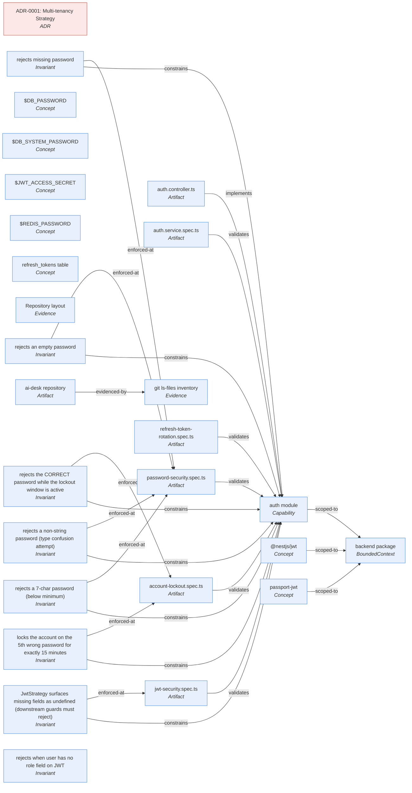

# Generated graph

> **A projection of the Canonical Knowledge Model.**
> Generated by the compiler. Do not edit.

**27 nodes, 24 edges.**

```mermaid
graph LR
  ADR_0001["ADR-0001: Multi-tenancy Strategy<br/><i>ADR</i>"]
  Artifact_AccountLockoutSpec["account-lockout.spec.ts<br/><i>Artifact</i>"]
  Artifact_AiDeskRepository["ai-desk repository<br/><i>Artifact</i>"]
  Artifact_AuthController["auth.controller.ts<br/><i>Artifact</i>"]
  Artifact_AuthServiceSpec["auth.service.spec.ts<br/><i>Artifact</i>"]
  Artifact_JwtSecuritySpec["jwt-security.spec.ts<br/><i>Artifact</i>"]
  Artifact_PasswordSecuritySpec["password-security.spec.ts<br/><i>Artifact</i>"]
  Artifact_RefreshTokenRotationSpec["refresh-token-rotation.spec.ts<br/><i>Artifact</i>"]
  BoundedContext_Backend["backend package<br/><i>BoundedContext</i>"]
  Capability_Auth["auth module<br/><i>Capability</i>"]
  Concept_EnvDbPassword["$DB_PASSWORD<br/><i>Concept</i>"]
  Concept_EnvDbSystemPassword["$DB_SYSTEM_PASSWORD<br/><i>Concept</i>"]
  Concept_EnvJwtAccessSecret["$JWT_ACCESS_SECRET<br/><i>Concept</i>"]
  Concept_EnvRedisPassword["$REDIS_PASSWORD<br/><i>Concept</i>"]
  Concept_NestjsJwt["@nestjs/jwt<br/><i>Concept</i>"]
  Concept_PassportJwt["passport-jwt<br/><i>Concept</i>"]
  Concept_TableRefreshTokens["refresh_tokens table<br/><i>Concept</i>"]
  Evidence_RepositoryInventory["git ls-files inventory<br/><i>Evidence</i>"]
  Evidence_RepositoryLayout["Repository layout<br/><i>Evidence</i>"]
  Invariant_JwtstrategySurfacesMissingFieldsAsUndef["JwtStrategy surfaces missing fields as undefined (downstream guards must reject)<br/><i>Invariant</i>"]
  Invariant_LocksTheAccountOnThe5ThWrongPassword["locks the account on the 5th wrong password for exactly 15 minutes<br/><i>Invariant</i>"]
  Invariant_RejectsA7CharPasswordBelowMinimum["rejects a 7-char password (below minimum)<br/><i>Invariant</i>"]
  Invariant_RejectsANonStringPasswordTypeConfusio["rejects a non-string password (type confusion attempt)<br/><i>Invariant</i>"]
  Invariant_RejectsAnEmptyPassword["rejects an empty password<br/><i>Invariant</i>"]
  Invariant_RejectsMissingPassword["rejects missing password<br/><i>Invariant</i>"]
  Invariant_RejectsTheCorrectPasswordWhileTheLocko["rejects the CORRECT password while the lockout window is active<br/><i>Invariant</i>"]
  Invariant_RejectsWhenUserHasNoRoleFieldOnJwt["rejects when user has no role field on JWT<br/><i>Invariant</i>"]
  Artifact_AccountLockoutSpec -->|validates| Capability_Auth
  Artifact_AiDeskRepository -->|evidenced-by| Evidence_RepositoryInventory
  Artifact_AuthController -->|implements| Capability_Auth
  Artifact_AuthServiceSpec -->|validates| Capability_Auth
  Artifact_JwtSecuritySpec -->|validates| Capability_Auth
  Artifact_PasswordSecuritySpec -->|validates| Capability_Auth
  Artifact_RefreshTokenRotationSpec -->|validates| Capability_Auth
  Capability_Auth -->|scoped-to| BoundedContext_Backend
  Concept_NestjsJwt -->|scoped-to| BoundedContext_Backend
  Concept_PassportJwt -->|scoped-to| BoundedContext_Backend
  Invariant_JwtstrategySurfacesMissingFieldsAsUndef -->|constrains| Capability_Auth
  Invariant_JwtstrategySurfacesMissingFieldsAsUndef -->|enforced-at| Artifact_JwtSecuritySpec
  Invariant_LocksTheAccountOnThe5ThWrongPassword -->|constrains| Capability_Auth
  Invariant_LocksTheAccountOnThe5ThWrongPassword -->|enforced-at| Artifact_AccountLockoutSpec
  Invariant_RejectsA7CharPasswordBelowMinimum -->|constrains| Capability_Auth
  Invariant_RejectsA7CharPasswordBelowMinimum -->|enforced-at| Artifact_PasswordSecuritySpec
  Invariant_RejectsANonStringPasswordTypeConfusio -->|constrains| Capability_Auth
  Invariant_RejectsANonStringPasswordTypeConfusio -->|enforced-at| Artifact_PasswordSecuritySpec
  Invariant_RejectsAnEmptyPassword -->|constrains| Capability_Auth
  Invariant_RejectsAnEmptyPassword -->|enforced-at| Artifact_PasswordSecuritySpec
  Invariant_RejectsMissingPassword -->|constrains| Capability_Auth
  Invariant_RejectsMissingPassword -->|enforced-at| Artifact_PasswordSecuritySpec
  Invariant_RejectsTheCorrectPasswordWhileTheLocko -->|constrains| Capability_Auth
  Invariant_RejectsTheCorrectPasswordWhileTheLocko -->|enforced-at| Artifact_AccountLockoutSpec
  class Artifact_AccountLockoutSpec,Artifact_AiDeskRepository,Artifact_AuthController,Artifact_AuthServiceSpec,Artifact_JwtSecuritySpec,Artifact_PasswordSecuritySpec,Artifact_RefreshTokenRotationSpec,BoundedContext_Backend,Capability_Auth,Concept_EnvDbPassword,Concept_EnvDbSystemPassword,Concept_EnvJwtAccessSecret,Concept_EnvRedisPassword,Concept_NestjsJwt,Concept_PassportJwt,Concept_TableRefreshTokens,Evidence_RepositoryInventory,Evidence_RepositoryLayout,Invariant_JwtstrategySurfacesMissingFieldsAsUndef,Invariant_LocksTheAccountOnThe5ThWrongPassword,Invariant_RejectsA7CharPasswordBelowMinimum,Invariant_RejectsANonStringPasswordTypeConfusio,Invariant_RejectsAnEmptyPassword,Invariant_RejectsMissingPassword,Invariant_RejectsTheCorrectPasswordWhileTheLocko,Invariant_RejectsWhenUserHasNoRoleFieldOnJwt descriptive;
  class ADR_0001 operational;
  classDef descriptive fill:#e8f0fe,stroke:#4285f4;
  classDef operational fill:#fce8e6,stroke:#ea4335;
```
