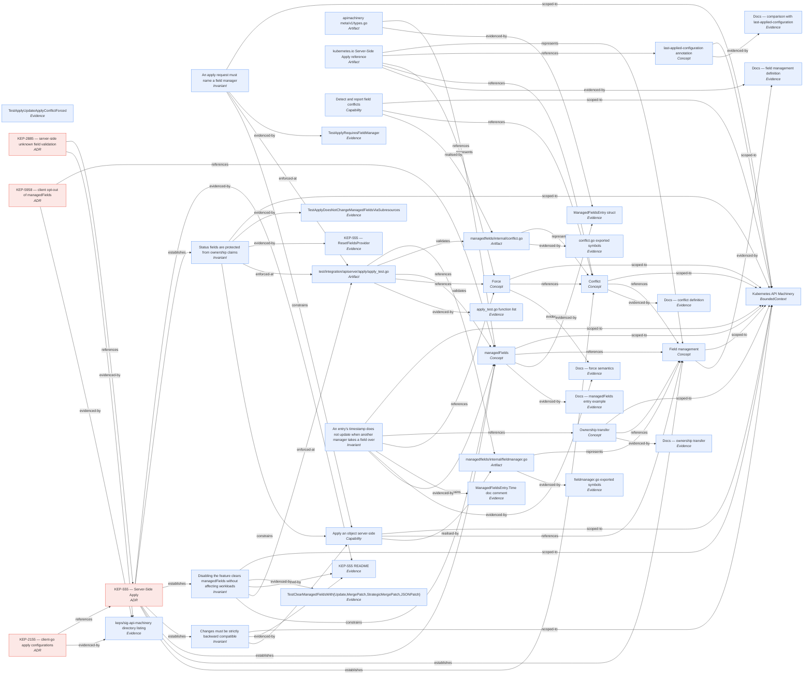

# Generated graph

> **A projection of the Canonical Knowledge Model.**
> Generated by the compiler. Do not edit.

**41 nodes, 75 edges.**

```mermaid
graph LR
  Artifact_ApplyIntegrationTest["test/integration/apiserver/apply/apply_test.go<br/><i>Artifact</i>"]
  Artifact_ConflictGo["managedfields/internal/conflict.go<br/><i>Artifact</i>"]
  Artifact_FieldManagerGo["managedfields/internal/fieldmanager.go<br/><i>Artifact</i>"]
  Artifact_MetaV1Types["apimachinery meta/v1/types.go<br/><i>Artifact</i>"]
  Artifact_SsaDocs["kubernetes.io Server-Side Apply reference<br/><i>Artifact</i>"]
  BC_ApiMachinery["Kubernetes API Machinery<br/><i>BoundedContext</i>"]
  Capability_ConflictDetection["Detect and report field conflicts<br/><i>Capability</i>"]
  Capability_ServerSideApply["Apply an object server-side<br/><i>Capability</i>"]
  Concept_Conflict["Conflict<br/><i>Concept</i>"]
  Concept_FieldManagement["Field management<br/><i>Concept</i>"]
  Concept_Force["Force<br/><i>Concept</i>"]
  Concept_LastAppliedAnnotation["last-applied-configuration annotation<br/><i>Concept</i>"]
  Concept_ManagedFields["managedFields<br/><i>Concept</i>"]
  Concept_OwnershipTransfer["Ownership transfer<br/><i>Concept</i>"]
  Evidence_ConflictSymbols["conflict.go exported symbols<br/><i>Evidence</i>"]
  Evidence_DocsConflict["Docs — conflict definition<br/><i>Evidence</i>"]
  Evidence_DocsFieldManagement["Docs — field management definition<br/><i>Evidence</i>"]
  Evidence_DocsForce["Docs — force semantics<br/><i>Evidence</i>"]
  Evidence_DocsLastApplied["Docs — comparison with last-applied-configuration<br/><i>Evidence</i>"]
  Evidence_DocsManagedFieldsShape["Docs — managedFields entry example<br/><i>Evidence</i>"]
  Evidence_DocsOwnershipTransfer["Docs — ownership transfer<br/><i>Evidence</i>"]
  Evidence_FieldManagerSymbols["fieldmanager.go exported symbols<br/><i>Evidence</i>"]
  Evidence_Kep555Readme["KEP-555 README<br/><i>Evidence</i>"]
  Evidence_Kep555ResetFields["KEP-555 — ResetFieldsProvider<br/><i>Evidence</i>"]
  Evidence_KepDirectoryListing["keps/sig-api-machinery directory listing<br/><i>Evidence</i>"]
  Evidence_ManagedFieldsEntryType["ManagedFieldsEntry struct<br/><i>Evidence</i>"]
  Evidence_TestClearManagedFields["TestClearManagedFieldsWith{Update,MergePatch,StrategicMergePatch,JSONPatch}<br/><i>Evidence</i>"]
  Evidence_TestConflictForced["TestApplyUpdateApplyConflictForced<br/><i>Evidence</i>"]
  Evidence_TestFunctionList["apply_test.go function list<br/><i>Evidence</i>"]
  Evidence_TestRequiresFieldManager["TestApplyRequiresFieldManager<br/><i>Evidence</i>"]
  Evidence_TestSubresources["TestApplyDoesNotChangeManagedFieldsViaSubresources<br/><i>Evidence</i>"]
  Evidence_TimeFieldComment["ManagedFieldsEntry.Time doc comment<br/><i>Evidence</i>"]
  Invariant_ApplyRequiresFieldManager["An apply request must name a field manager<br/><i>Invariant</i>"]
  Invariant_BackwardCompatible["Changes must be strictly backward compatible<br/><i>Invariant</i>"]
  Invariant_RollbackClearsManagedFields["Disabling the feature clears managedFields without affecting workloads<br/><i>Invariant</i>"]
  Invariant_StatusFieldsProtected["Status fields are protected from ownership claims<br/><i>Invariant</i>"]
  Invariant_TimestampNotUpdatedOnTakeover["An entry's timestamp does not update when another manager takes a field over<br/><i>Invariant</i>"]
  KEP_2155["KEP-2155 — client-go apply configurations<br/><i>ADR</i>"]
  KEP_2885["KEP-2885 — server-side unknown field validation<br/><i>ADR</i>"]
  KEP_555["KEP-555 — Server-Side Apply<br/><i>ADR</i>"]
  KEP_5958["KEP-5958 — client opt-out of managedFields<br/><i>ADR</i>"]
  Artifact_ApplyIntegrationTest -->|evidenced-by| Evidence_TestFunctionList
  Artifact_ApplyIntegrationTest -->|references| Concept_Force
  Artifact_ApplyIntegrationTest -->|references| Concept_ManagedFields
  Artifact_ApplyIntegrationTest -->|validates| Artifact_ConflictGo
  Artifact_ApplyIntegrationTest -->|validates| Artifact_FieldManagerGo
  Artifact_ConflictGo -->|evidenced-by| Evidence_ConflictSymbols
  Artifact_ConflictGo -->|represents| Concept_Conflict
  Artifact_FieldManagerGo -->|evidenced-by| Evidence_FieldManagerSymbols
  Artifact_FieldManagerGo -->|represents| Concept_FieldManagement
  Artifact_MetaV1Types -->|evidenced-by| Evidence_ManagedFieldsEntryType
  Artifact_MetaV1Types -->|represents| Concept_ManagedFields
  Artifact_SsaDocs -->|evidenced-by| Evidence_DocsFieldManagement
  Artifact_SsaDocs -->|references| Concept_Conflict
  Artifact_SsaDocs -->|references| Concept_Force
  Artifact_SsaDocs -->|references| Concept_LastAppliedAnnotation
  Artifact_SsaDocs -->|represents| Concept_FieldManagement
  Capability_ConflictDetection -->|realised-by| Artifact_ConflictGo
  Capability_ConflictDetection -->|references| Concept_Conflict
  Capability_ConflictDetection -->|scoped-to| BC_ApiMachinery
  Capability_ServerSideApply -->|realised-by| Artifact_FieldManagerGo
  Capability_ServerSideApply -->|references| Concept_FieldManagement
  Capability_ServerSideApply -->|scoped-to| BC_ApiMachinery
  Concept_Conflict -->|evidenced-by| Evidence_DocsConflict
  Concept_Conflict -->|references| Concept_FieldManagement
  Concept_Conflict -->|scoped-to| BC_ApiMachinery
  Concept_FieldManagement -->|evidenced-by| Evidence_DocsFieldManagement
  Concept_FieldManagement -->|scoped-to| BC_ApiMachinery
  Concept_Force -->|evidenced-by| Evidence_DocsForce
  Concept_Force -->|references| Concept_Conflict
  Concept_Force -->|scoped-to| BC_ApiMachinery
  Concept_LastAppliedAnnotation -->|evidenced-by| Evidence_DocsLastApplied
  Concept_LastAppliedAnnotation -->|scoped-to| BC_ApiMachinery
  Concept_ManagedFields -->|evidenced-by| Evidence_DocsManagedFieldsShape
  Concept_ManagedFields -->|evidenced-by| Evidence_ManagedFieldsEntryType
  Concept_ManagedFields -->|references| Concept_FieldManagement
  Concept_ManagedFields -->|scoped-to| BC_ApiMachinery
  Concept_OwnershipTransfer -->|evidenced-by| Evidence_DocsOwnershipTransfer
  Concept_OwnershipTransfer -->|references| Concept_FieldManagement
  Concept_OwnershipTransfer -->|scoped-to| BC_ApiMachinery
  Invariant_ApplyRequiresFieldManager -->|constrains| Capability_ServerSideApply
  Invariant_ApplyRequiresFieldManager -->|enforced-at| Artifact_ApplyIntegrationTest
  Invariant_ApplyRequiresFieldManager -->|evidenced-by| Evidence_TestRequiresFieldManager
  Invariant_ApplyRequiresFieldManager -->|scoped-to| BC_ApiMachinery
  Invariant_BackwardCompatible -->|constrains| Capability_ServerSideApply
  Invariant_BackwardCompatible -->|evidenced-by| Evidence_Kep555Readme
  Invariant_BackwardCompatible -->|scoped-to| BC_ApiMachinery
  Invariant_RollbackClearsManagedFields -->|constrains| Concept_ManagedFields
  Invariant_RollbackClearsManagedFields -->|enforced-at| Artifact_ApplyIntegrationTest
  Invariant_RollbackClearsManagedFields -->|evidenced-by| Evidence_Kep555Readme
  Invariant_RollbackClearsManagedFields -->|evidenced-by| Evidence_TestClearManagedFields
  Invariant_RollbackClearsManagedFields -->|scoped-to| BC_ApiMachinery
  Invariant_StatusFieldsProtected -->|constrains| Capability_ServerSideApply
  Invariant_StatusFieldsProtected -->|enforced-at| Artifact_ApplyIntegrationTest
  Invariant_StatusFieldsProtected -->|evidenced-by| Evidence_Kep555ResetFields
  Invariant_StatusFieldsProtected -->|evidenced-by| Evidence_TestSubresources
  Invariant_StatusFieldsProtected -->|scoped-to| BC_ApiMachinery
  Invariant_TimestampNotUpdatedOnTakeover -->|constrains| Concept_ManagedFields
  Invariant_TimestampNotUpdatedOnTakeover -->|evidenced-by| Evidence_DocsForce
  Invariant_TimestampNotUpdatedOnTakeover -->|evidenced-by| Evidence_TimeFieldComment
  Invariant_TimestampNotUpdatedOnTakeover -->|references| Concept_Force
  Invariant_TimestampNotUpdatedOnTakeover -->|references| Concept_OwnershipTransfer
  Invariant_TimestampNotUpdatedOnTakeover -->|scoped-to| BC_ApiMachinery
  KEP_2155 -->|evidenced-by| Evidence_KepDirectoryListing
  KEP_2155 -->|references| KEP_555
  KEP_2885 -->|evidenced-by| Evidence_KepDirectoryListing
  KEP_2885 -->|references| KEP_555
  KEP_555 -->|establishes| Concept_Conflict
  KEP_555 -->|establishes| Concept_FieldManagement
  KEP_555 -->|establishes| Concept_ManagedFields
  KEP_555 -->|establishes| Invariant_BackwardCompatible
  KEP_555 -->|establishes| Invariant_RollbackClearsManagedFields
  KEP_555 -->|establishes| Invariant_StatusFieldsProtected
  KEP_555 -->|evidenced-by| Evidence_Kep555Readme
  KEP_5958 -->|evidenced-by| Evidence_KepDirectoryListing
  KEP_5958 -->|references| Concept_ManagedFields
  class Artifact_ApplyIntegrationTest,Artifact_ConflictGo,Artifact_FieldManagerGo,Artifact_MetaV1Types,Artifact_SsaDocs,BC_ApiMachinery,Capability_ConflictDetection,Capability_ServerSideApply,Concept_Conflict,Concept_FieldManagement,Concept_Force,Concept_LastAppliedAnnotation,Concept_ManagedFields,Concept_OwnershipTransfer,Evidence_ConflictSymbols,Evidence_DocsConflict,Evidence_DocsFieldManagement,Evidence_DocsForce,Evidence_DocsLastApplied,Evidence_DocsManagedFieldsShape,Evidence_DocsOwnershipTransfer,Evidence_FieldManagerSymbols,Evidence_Kep555Readme,Evidence_Kep555ResetFields,Evidence_KepDirectoryListing,Evidence_ManagedFieldsEntryType,Evidence_TestClearManagedFields,Evidence_TestConflictForced,Evidence_TestFunctionList,Evidence_TestRequiresFieldManager,Evidence_TestSubresources,Evidence_TimeFieldComment,Invariant_ApplyRequiresFieldManager,Invariant_BackwardCompatible,Invariant_RollbackClearsManagedFields,Invariant_StatusFieldsProtected,Invariant_TimestampNotUpdatedOnTakeover descriptive;
  class KEP_2155,KEP_2885,KEP_555,KEP_5958 operational;
  classDef descriptive fill:#e8f0fe,stroke:#4285f4;
  classDef operational fill:#fce8e6,stroke:#ea4335;
```
