# View 1 — Markdown entity graph

> **Generated by `tools/generate-metamodel-views.py`. Do not edit.**
> A derived artifact (`ADR-0012`). Edit the sources and regenerate.

Edges are the `relationships` tables of every entity specification, restricted to targets that are themselves specified entities.

**22 entities, 58 internal edges.**

```mermaid
graph LR
  AcceptanceRecord[AcceptanceRecord]
  ArtifactRevision[ArtifactRevision]
  AcceptanceRecord -->|accepts| ArtifactRevision
  Actor[Actor]
  AcceptanceRecord -->|reviewed-by| Actor
  Evidence[Evidence]
  AcceptanceRecord -->|cites| Evidence
  Capability[Capability]
  Actor -->|uses| Capability
  BoundedContext[BoundedContext]
  Actor -->|scoped-to| BoundedContext
  ADR[ADR]
  Issue[Issue]
  ADR -->|resolves| Issue
  Artifact[Artifact]
  ArtifactRevision -->|revises| Artifact
  ArtifactRevision -->|accepted-by| AcceptanceRecord
  DimensionAssignment[DimensionAssignment]
  ArtifactRevision -->|classified-by| DimensionAssignment
  Artifact -->|owns| ArtifactRevision
  Artifact -->|has-active-revision| ArtifactRevision
  Artifact -->|classified-by| DimensionAssignment
  Concept[Concept]
  BoundedContext -->|contains| Concept
  BoundedContext -->|contains| Capability
  Capability -->|provided-by| BoundedContext
  Capability -->|expressed-in| Concept
  Workflow[Workflow]
  Capability -->|realised-by| Workflow
  Skill[Skill]
  Capability -->|realised-by| Skill
  Invariant[Invariant]
  Capability -->|preserves| Invariant
  Capability -->|invoked-by| Actor
  Concept -->|defined-in| BoundedContext
  Concept -->|expressed-in| Capability
  Concept -->|expressed-in| Invariant
  Concept -->|evidenced-by| Evidence
  DimensionAssignment -->|classifies| ArtifactRevision
  Dimension[Dimension]
  DimensionAssignment -->|along| Dimension
  DimensionSpecification[DimensionSpecification]
  DimensionSpecification -->|instantiated-by| Dimension
  Dimension -->|specified-by| DimensionSpecification
  Dimension -->|assigns-via| DimensionAssignment
  EngineeringGate[EngineeringGate]
  EngineeringGate -->|reviews| Artifact
  EngineeringGate -->|decided-by| Actor
  Evidence -->|references| Artifact
  Evidence -->|observed-at| ArtifactRevision
  Invariant -->|constrains| Concept
  Invariant -->|constrains| Capability
  Invariant -->|scoped-to| BoundedContext
  Invariant -->|enforced-at| Artifact
  Invariant -->|evidenced-by| Evidence
  Issue -->|blocks| Artifact
  Issue -->|resolved-by| ADR
  Issue -->|evidenced-by| Evidence
  Policy[Policy]
  Policy -->|governs| Workflow
  Policy -->|governs| EngineeringGate
  Policy -->|governs| Artifact
  RelationshipType[RelationshipType]
  RelationshipType -->|scoped-to| BoundedContext
  RelationshipType -->|constrained-by| Invariant
  Skill -->|requires| Artifact
  Skill -->|requires| Concept
  Skill -->|produces| Artifact
  WorkflowStep[WorkflowStep]
  Skill -->|executed-by| WorkflowStep
  StateMachineSpecification[StateMachineSpecification]
  StateMachineSpecification -->|driven-by| Workflow
  StateMachineSpecification -->|scoped-to| BoundedContext
  StateMachine[StateMachine]
  StateMachine -->|specified-by| StateMachineSpecification
  WorkflowStep -->|step-of| Workflow
  WorkflowStep -->|executes| Skill
  Workflow -->|has-step| WorkflowStep
  Workflow -->|passes-through| EngineeringGate
  Workflow -->|produces| Artifact
  class Actor,ArtifactRevision,Artifact,BoundedContext,Capability,Concept,DimensionAssignment,DimensionSpecification,Dimension,Evidence,Invariant,RelationshipType,StateMachineSpecification,StateMachine descriptive;
  class AcceptanceRecord,ADR,EngineeringGate,Issue,Policy,Skill,WorkflowStep,Workflow operational;
  classDef descriptive fill:#e8f0fe,stroke:#4285f4;
  classDef operational fill:#fce8e6,stroke:#ea4335;
```

## Structural metrics

**22 nodes.** Computed from the graph, not read from the specifications.

### Isolated and near-isolated

No isolated nodes.

**Pendant (degree 1):** `ADR`, `DimensionSpecification`, `StateMachine`

### Hubs (degree ≥ 5)

| Node | Degree |
|---|---|
| `Artifact` | 9 |
| `Workflow` | 6 |
| `Invariant` | 6 |
| `Evidence` | 6 |
| `Capability` | 6 |
| `BoundedContext` | 6 |
| `Concept` | 5 |

### Near-identical neighbourhoods (Jaccard ≥ 0.6)

| Similarity | A | B | Shared neighbours |
|---|---|---|---|
| 0.67 | `EngineeringGate` | `Policy` | `Artifact`, `Workflow` |

### Chains (in-degree 1, out-degree 1)

`ADR`, `DimensionSpecification`

### Repeated motifs (relation used ≥ 3 times)

| Count | Relation |
|---|---|
| 4 | `scoped-to` |
| 3 | `governs` |
| 3 | `expressed-in` |
| 3 | `evidenced-by` |
