# View 2 — OWL class hierarchy

> **Generated by `tools/generate-metamodel-views.py`. Do not edit.**
> A derived artifact (`ADR-0012`). Edit the sources and regenerate.

`rdfs:subClassOf` between named classes. Restrictions are blank nodes and do not appear.

**30 classes, 28 subclass edges.**

```mermaid
graph BT
  DescriptiveEntity[DescriptiveEntity]
  MetamodelEntity[MetamodelEntity]
  DescriptiveEntity -->|is-a| MetamodelEntity
  OperationalEntity[OperationalEntity]
  OperationalEntity -->|is-a| MetamodelEntity
  ContextualEntity[ContextualEntity]
  ContextualEntity -->|is-a| DescriptiveEntity
  BoundedContext[BoundedContext]
  BoundedContext -->|is-a| DescriptiveEntity
  Evidence[Evidence]
  Evidence -->|is-a| DescriptiveEntity
  Artifact[Artifact]
  Artifact -->|is-a| DescriptiveEntity
  ArtifactRevision[ArtifactRevision]
  ArtifactRevision -->|is-a| DescriptiveEntity
  DimensionSpecification[DimensionSpecification]
  DimensionSpecification -->|is-a| DescriptiveEntity
  Dimension[Dimension]
  Dimension -->|is-a| DescriptiveEntity
  DimensionAssignment[DimensionAssignment]
  DimensionAssignment -->|is-a| DescriptiveEntity
  StateMachineSpecification[StateMachineSpecification]
  StateMachineSpecification -->|is-a| DescriptiveEntity
  StateMachine[StateMachine]
  StateMachine -->|is-a| DescriptiveEntity
  Concept[Concept]
  Concept -->|is-a| ContextualEntity
  Capability[Capability]
  Capability -->|is-a| ContextualEntity
  Invariant[Invariant]
  Invariant -->|is-a| ContextualEntity
  Actor[Actor]
  Actor -->|is-a| ContextualEntity
  RelationshipType[RelationshipType]
  RelationshipType -->|is-a| ContextualEntity
  Policy[Policy]
  Policy -->|is-a| OperationalEntity
  Skill[Skill]
  Skill -->|is-a| OperationalEntity
  Workflow[Workflow]
  Workflow -->|is-a| OperationalEntity
  EngineeringGate[EngineeringGate]
  EngineeringGate -->|is-a| OperationalEntity
  AcceptanceRecord[AcceptanceRecord]
  AcceptanceRecord -->|is-a| OperationalEntity
  ADR[ADR]
  ADR -->|is-a| OperationalEntity
  Issue[Issue]
  Issue -->|is-a| OperationalEntity
  WorkflowStep[WorkflowStep]
  WorkflowStep -->|is-a| OperationalEntity
  GovernancePolicy[GovernancePolicy]
  GovernancePolicy -->|is-a| Policy
  ModelingPolicy[ModelingPolicy]
  ModelingPolicy -->|is-a| Policy
  ProcessPolicy[ProcessPolicy]
  ProcessPolicy -->|is-a| Policy
```

## Structural metrics

**30 nodes.** Computed from the graph, not read from the specifications.

### Isolated and near-isolated

**Isolated (degree 0):** `EvidenceKind`

**Pendant (degree 1):** `ADR`, `AcceptanceRecord`, `Actor`, `Artifact`, `ArtifactRevision`, `BoundedContext`, `Capability`, `Concept`, `Dimension`, `DimensionAssignment`, `DimensionSpecification`, `EngineeringGate`, `Evidence`, `GovernancePolicy`, `Invariant`, `Issue`, `ModelingPolicy`, `ProcessPolicy`, `RelationshipType`, `Skill`, `StateMachine`, `StateMachineSpecification`, `Workflow`, `WorkflowStep`

### Hubs (degree ≥ 5)

| Node | Degree |
|---|---|
| `DescriptiveEntity` | 11 |
| `OperationalEntity` | 9 |
| `ContextualEntity` | 6 |

### Near-identical neighbourhoods (Jaccard ≥ 0.6)

| Similarity | A | B | Shared neighbours |
|---|---|---|---|
| 1.0 | `Workflow` | `WorkflowStep` | `OperationalEntity` |
| 1.0 | `StateMachine` | `StateMachineSpecification` | `DescriptiveEntity` |
| 1.0 | `Skill` | `WorkflowStep` | `OperationalEntity` |
| 1.0 | `Skill` | `Workflow` | `OperationalEntity` |
| 1.0 | `ModelingPolicy` | `ProcessPolicy` | `Policy` |
| 1.0 | `Issue` | `WorkflowStep` | `OperationalEntity` |
| 1.0 | `Issue` | `Workflow` | `OperationalEntity` |
| 1.0 | `Issue` | `Skill` | `OperationalEntity` |
| 1.0 | `Invariant` | `RelationshipType` | `ContextualEntity` |
| 1.0 | `GovernancePolicy` | `ProcessPolicy` | `Policy` |
| 1.0 | `GovernancePolicy` | `ModelingPolicy` | `Policy` |
| 1.0 | `Evidence` | `StateMachineSpecification` | `DescriptiveEntity` |
| 1.0 | `Evidence` | `StateMachine` | `DescriptiveEntity` |
| 1.0 | `EngineeringGate` | `WorkflowStep` | `OperationalEntity` |
| 1.0 | `EngineeringGate` | `Workflow` | `OperationalEntity` |

### Chains (in-degree 1, out-degree 1)

None.

### Repeated motifs (relation used ≥ 3 times)

| Count | Relation |
|---|---|
| 28 | `is-a` |
