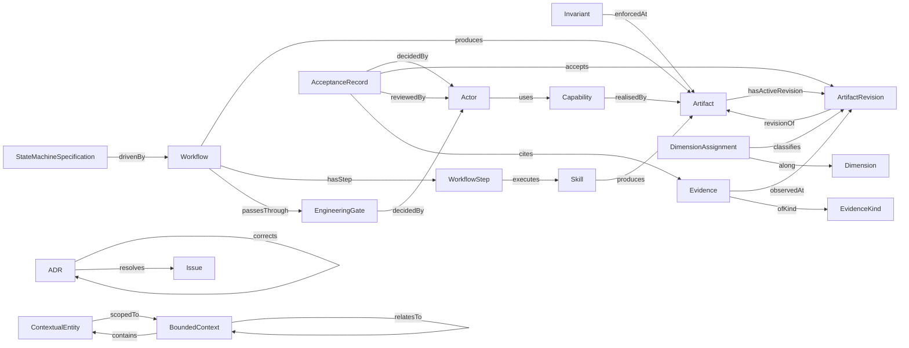

# View 3 — Relationship dependency graph

> **Generated by `tools/generate-metamodel-views.py`. Do not edit.**
> A derived artifact (`ADR-0012`). Edit the sources and regenerate.

Every `owl:ObjectProperty` with a declared domain and a named range. Properties whose range was deliberately omitted do not appear — that omission is itself a finding (`FINDINGS.md` #8).

**19 classes connected by 26 properties.**

## Structural metrics

**19 nodes.** Computed from the graph, not read from the specifications.

### Isolated and near-isolated

No isolated nodes.

**Pendant (degree 1):** `ContextualEntity`, `Dimension`, `EvidenceKind`, `Invariant`, `Issue`, `StateMachineSpecification`

### Hubs (degree ≥ 5)

| Node | Degree |
|---|---|
| `Artifact` | 5 |

### Near-identical neighbourhoods (Jaccard ≥ 0.6)

None above threshold.

### Chains (in-degree 1, out-degree 1)

`Capability`, `ContextualEntity`, `EngineeringGate`, `Skill`, `WorkflowStep`

### Repeated motifs (relation used ≥ 3 times)

None.
