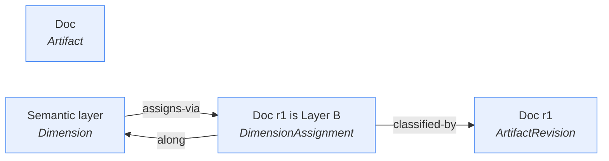

# Generated graph

> **A projection of the Canonical Knowledge Model.**
> Generated by `tools/compile.py`. Do not edit.

**4 nodes, 3 edges.**

```mermaid
graph LR
  Artifact_Doc["Doc<br/><i>Artifact</i>"]
  ArtifactRevision_Doc_r1["Doc r1<br/><i>ArtifactRevision</i>"]
  Dimension_SemanticLayer["Semantic layer<br/><i>Dimension</i>"]
  DimensionAssignment_1["Doc r1 is Layer B<br/><i>DimensionAssignment</i>"]
  Dimension_SemanticLayer -->|assigns-via| DimensionAssignment_1
  DimensionAssignment_1 -->|along| Dimension_SemanticLayer
  DimensionAssignment_1 -->|classified-by| ArtifactRevision_Doc_r1
  class Artifact_Doc,ArtifactRevision_Doc_r1,Dimension_SemanticLayer,DimensionAssignment_1 descriptive;
  classDef descriptive fill:#e8f0fe,stroke:#4285f4;
  classDef operational fill:#fce8e6,stroke:#ea4335;
```
