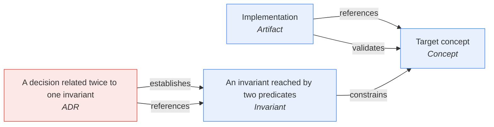

# Generated graph

> **A projection of the Canonical Knowledge Model.**
> Generated by the compiler. Do not edit.

**4 nodes, 5 edges.**

```mermaid
graph LR
  ADR_Twice["A decision related twice to one invariant<br/><i>ADR</i>"]
  Artifact_Impl["Implementation<br/><i>Artifact</i>"]
  Concept_Target["Target concept<br/><i>Concept</i>"]
  Invariant_Both["An invariant reached by two predicates<br/><i>Invariant</i>"]
  ADR_Twice -->|establishes| Invariant_Both
  ADR_Twice -->|references| Invariant_Both
  Artifact_Impl -->|references| Concept_Target
  Artifact_Impl -->|validates| Concept_Target
  Invariant_Both -->|constrains| Concept_Target
  class Artifact_Impl,Concept_Target,Invariant_Both descriptive;
  class ADR_Twice operational;
  classDef descriptive fill:#e8f0fe,stroke:#4285f4;
  classDef operational fill:#fce8e6,stroke:#ea4335;
```
