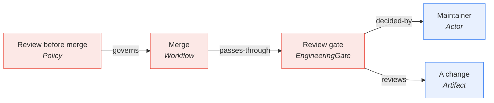

# Generated graph

> **A projection of the Canonical Knowledge Model.**
> Generated by the compiler. Do not edit.

**5 nodes, 4 edges.**

```mermaid
graph LR
  Actor_Maintainer["Maintainer<br/><i>Actor</i>"]
  Artifact_Change["A change<br/><i>Artifact</i>"]
  Gate_Review["Review gate<br/><i>EngineeringGate</i>"]
  Policy_ReviewBeforeMerge["Review before merge<br/><i>Policy</i>"]
  Workflow_Merge["Merge<br/><i>Workflow</i>"]
  Gate_Review -->|decided-by| Actor_Maintainer
  Gate_Review -->|reviews| Artifact_Change
  Policy_ReviewBeforeMerge -->|governs| Workflow_Merge
  Workflow_Merge -->|passes-through| Gate_Review
  class Actor_Maintainer,Artifact_Change descriptive;
  class Gate_Review,Policy_ReviewBeforeMerge,Workflow_Merge operational;
  classDef descriptive fill:#e8f0fe,stroke:#4285f4;
  classDef operational fill:#fce8e6,stroke:#ea4335;
```
