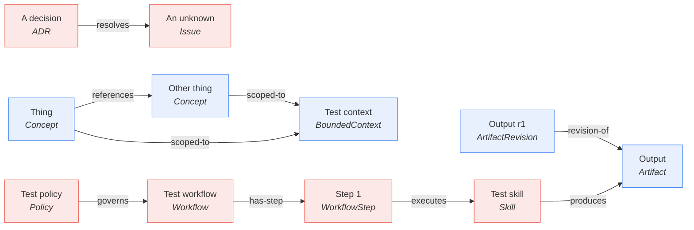

# Generated graph

> **A projection of the Canonical Knowledge Model.**
> Generated by `tools/compile.py`. Do not edit.

**11 nodes, 9 edges.**

```mermaid
graph LR
  ADR_T["A decision<br/><i>ADR</i>"]
  Artifact_Out["Output<br/><i>Artifact</i>"]
  ArtifactRevision_Out_r1["Output r1<br/><i>ArtifactRevision</i>"]
  BC_Test["Test context<br/><i>BoundedContext</i>"]
  Concept_Other["Other thing<br/><i>Concept</i>"]
  Concept_Thing["Thing<br/><i>Concept</i>"]
  Issue_T["An unknown<br/><i>Issue</i>"]
  Policy_Test["Test policy<br/><i>Policy</i>"]
  Skill_Test["Test skill<br/><i>Skill</i>"]
  Workflow_Test["Test workflow<br/><i>Workflow</i>"]
  WorkflowStep_Test_1["Step 1<br/><i>WorkflowStep</i>"]
  ADR_T -->|resolves| Issue_T
  ArtifactRevision_Out_r1 -->|revision-of| Artifact_Out
  Concept_Other -->|scoped-to| BC_Test
  Concept_Thing -->|references| Concept_Other
  Concept_Thing -->|scoped-to| BC_Test
  Policy_Test -->|governs| Workflow_Test
  Skill_Test -->|produces| Artifact_Out
  Workflow_Test -->|has-step| WorkflowStep_Test_1
  WorkflowStep_Test_1 -->|executes| Skill_Test
  class Artifact_Out,ArtifactRevision_Out_r1,BC_Test,Concept_Other,Concept_Thing descriptive;
  class ADR_T,Issue_T,Policy_Test,Skill_Test,Workflow_Test,WorkflowStep_Test_1 operational;
  classDef descriptive fill:#e8f0fe,stroke:#4285f4;
  classDef operational fill:#fce8e6,stroke:#ea4335;
```
