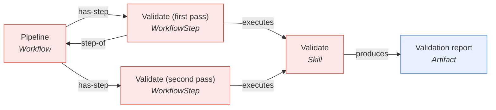

# Generated graph

> **A projection of the Canonical Knowledge Model.**
> Generated by `tools/compile.py`. Do not edit.

**5 nodes, 6 edges.**

```mermaid
graph LR
  Artifact_Report["Validation report<br/><i>Artifact</i>"]
  Skill_Validate["Validate<br/><i>Skill</i>"]
  Workflow_Pipeline["Pipeline<br/><i>Workflow</i>"]
  WorkflowStep_P_1["Validate (first pass)<br/><i>WorkflowStep</i>"]
  WorkflowStep_P_3["Validate (second pass)<br/><i>WorkflowStep</i>"]
  Skill_Validate -->|produces| Artifact_Report
  Workflow_Pipeline -->|has-step| WorkflowStep_P_1
  Workflow_Pipeline -->|has-step| WorkflowStep_P_3
  WorkflowStep_P_1 -->|executes| Skill_Validate
  WorkflowStep_P_1 -->|step-of| Workflow_Pipeline
  WorkflowStep_P_3 -->|executes| Skill_Validate
  class Artifact_Report descriptive;
  class Skill_Validate,Workflow_Pipeline,WorkflowStep_P_1,WorkflowStep_P_3 operational;
  classDef descriptive fill:#e8f0fe,stroke:#4285f4;
  classDef operational fill:#fce8e6,stroke:#ea4335;
```
